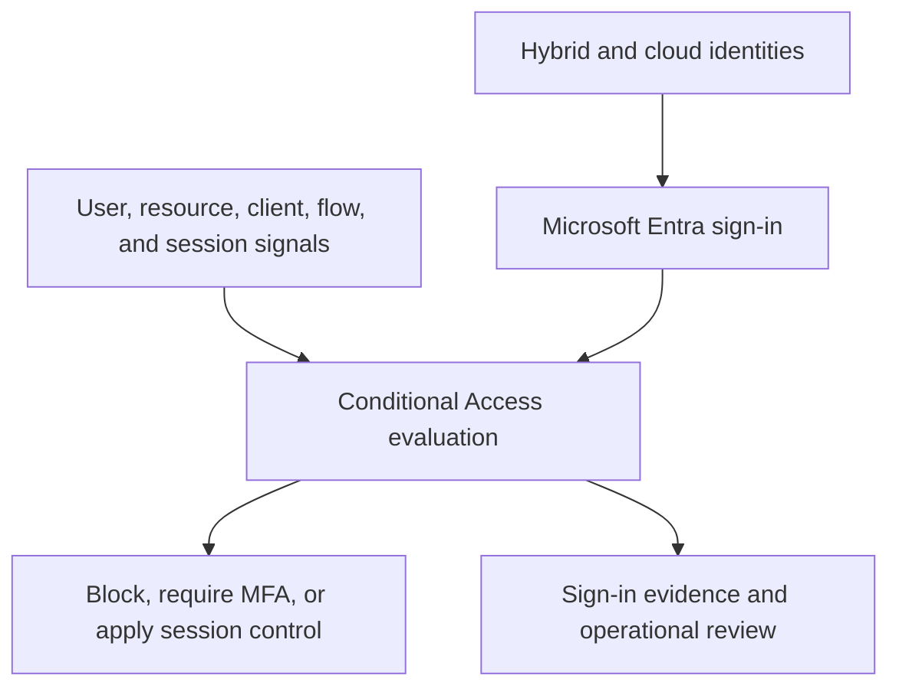

# Microsoft Entra Conditional Access & Zero Trust Policy Framework

## Implementation status

**Status: Complete.** Within the documented controlled-lab scope, five Microsoft Entra Conditional Access policies were designed, tested in Report-only, enforced sequentially, and accepted through final technical assurance and operational handover.

This controlled laboratory demonstrates how identity risks were translated into a governed Conditional Access framework rather than enabling disconnected portal settings. The work documented business requirements, protected recovery access, activated the required licensing, created a ten-policy target design, implemented five priority controls, tested expected and unexpected outcomes, monitored the rollout, and recorded the remaining risks.

The result applies to an isolated synthetic lab. It is not a claim of organization-wide production deployment.

## Executive overview

| Area | Result |
| --- | --- |
| Business objective | Reduce identity attack paths while preserving administrative recovery and controlled user access |
| Platform | Microsoft Entra ID P2 trial with a hybrid identity foundation synchronized through Microsoft Entra Cloud Sync |
| Licensing boundary | Entra ID P1 supports standard Conditional Access; P2 is specifically required for the risk-based CA006 and CA007 designs |
| Implemented controls | Legacy-client block, management MFA, security-information registration MFA, nonpersistent contractor sessions, and device-code-flow block |
| Deployment method | Requirements and design, prerequisites, Report-only analysis, controlled testing, one-policy-at-a-time enforcement, and final assurance |
| Recovery | Two cloud-only emergency identities excluded from the Wave 1 policies and tested before, during, and after enforcement |
| Strongest negative test | A real device-code authentication attempt was blocked by CA010 and recorded as Conditional Access Failure with error `53003` |
| Final assurance | Five policies On, zero unexpected Conditional Access failures, eleven successful recorded configuration changes, and zero deleted policies |
| Known constraints | Controlled scope, shortened Report-only observation, no Log Analytics workbook, four standing Global Administrators, and P2 trial expiry |

## Engineering scope

- Conditional Access and Zero Trust policy architecture
- Business requirement and control mapping
- Group-based pilot scoping and exclusion design
- Emergency-access and lockout prevention
- Authentication strengths, MFA grant controls, client-app conditions, authentication-flow controls, and session controls
- Report-only analysis, What If evaluation, and enforced scenario testing
- Microsoft Entra sign-in and audit-log investigation
- Sequential change control, rollback planning, and operational handover
- Evidence sanitization and automated repository validation

## Business scenario and scope

The lab represents an organization replacing baseline security defaults with explicit, testable Conditional Access controls. Its hybrid foundation retained 34 synthetic identities and 15 groups synchronized from the `corporate.test` Active Directory environment through Microsoft Entra Cloud Sync.

The Conditional Access implementation used smaller cloud control populations for safe enforcement:

| Population | Final controlled state |
| --- | --- |
| Entra ID P2 trial allocation | 7 of 100 trial licences assigned |
| Workforce pilot | 3 direct members |
| Contractor scope | 5 direct members |
| Emergency exclusion group | 2 cloud-only direct members |
| Privileged role finding | 4 permanent-active Global Administrators, including the 2 emergency identities |

These populations overlap and should not be added together as a tenant-user total. Enforcement intentionally remained limited to approved pilot and contractor assignments.

The P2 trial includes the P1 rights required for standard Conditional Access. However, a tenant-level seat count does not prove that every identity benefiting from an enforced policy is correctly licensed. The published evidence confirms seven P2 assignments but does not map those assignments to all five CA009 contractor members. That entitlement mapping therefore remains a live-tenant reconciliation item rather than a completed licensing claim.

### Policy-name clarification

Several policy display names contain `AllUsers` because the names represent the approved target-state design. During controlled implementation, CA001, CA004, CA005, and CA010 remained assigned to `GG_CA_Pilot_Workforce`; CA009 targeted `GG_IAM_All_Contractors`. The policy matrix records both the final intended scope and the implemented pilot scope. The display name alone must not be interpreted as evidence of tenant-wide enforcement.

## Zero Trust access model



The detailed [Zero Trust Conditional Access Architecture](architecture/Zero-Trust-Conditional-Access-Architecture.md) maps identity sources, trust boundaries, decision signals, recovery paths, failure containment, and monitoring responsibilities.

## Implemented Wave 1 controls

| Policy | Implemented scope and control | Validated result |
| --- | --- | --- |
| `CA001-BLOCK-LegacyAuthentication-AllUsers` | Workforce pilot; all resources; block Exchange ActiveSync and other legacy clients | On; What If predicted Block for the legacy condition; modern browser correctly returned Not applied; no obsolete client was introduced purely for evidence |
| `CA004-GRANT-MFA-ManagementSurfaces-AllUsers` | Workforce pilot; Microsoft admin portals and Azure management; require the built-in Multifactor authentication strength | On; controlled management sign-in required MFA and recorded Success |
| `CA005-GRANT-MFA-SecurityInfoRegistration-AllUsers` | Workforce pilot; Register security information user action; require MFA | On; controlled registration access required MFA and recorded Success without changing an authentication method |
| `CA009-SESSION-NoPersistentBrowser-Contractors` | Contractor group; browser access to all resources; persistent browser session set to Never persistent | On; policy recorded Success and the isolated browser profile required credentials again after restart |
| `CA010-BLOCK-DeviceCodeFlow-AllUsers` | Workforce pilot; all resources; block device code flow | On; a controlled device-code sign-in was denied and recorded as Failure under CA010 |

All five policies excluded the controlled emergency-access group. Exact assignments, conditions, controls, dependencies, expected results, monitoring signals, and rollback criteria are maintained in the [Conditional Access Policy Matrix](policies/Conditional-Access-Policy-Matrix.md).


## Deliberately deferred controls

Five additional policy families were designed but not deployed because their prerequisites or change approvals were incomplete.

| Policy | Intended control | Reason for deferral |
| --- | --- | --- |
| CA002 | Universal MFA for all users and resources | Requires broader MFA readiness and an approved scope-expansion decision |
| CA003 | Phishing-resistant MFA for privileged roles | Privileged authentication readiness and role redesign belong to the planned PIM implementation |
| CA006 | MFA for medium/high sign-in risk | Requires a separately governed Identity Protection rollout and representative risk testing |
| CA007 | High user-risk remediation | Requires controlled risk simulation and dependable hybrid password-remediation operations |
| CA008 | Compliant device for sensitive workforce access | Intune, a compliance policy, enrollment, and an isolated managed-device pilot were absent |

Deferral is an intentional engineering decision. The repository does not present an untested design as an implemented control.

## Delivery journey

| Milestone | Engineering outcome |
| --- | --- |
| 0 - Foundation | Established the repository, privacy rules, naming standard, and validation approach |
| 1 - Baseline | Assessed security defaults, authentication methods, licensing, Conditional Access availability, named locations, devices, and recovery gaps |
| 2 - Design | Defined eleven business requirements, ten policies, architecture, test scenarios, dependencies, monitoring, and rollback criteria |
| 3 - Prerequisites | Activated P2, created and tested two emergency identities, populated the pilot group, confirmed authentication readiness, and validated password writeback |
| 4 - Report-only | Created the five Wave 1 policies in Report-only and validated their tenant configurations |
| 5 - Scenario analysis | Tested applicable, nonapplicable, exclusion, MFA, session, and device-code outcomes using What If and sign-in evidence |
| 6 - Enforcement | Moved each policy to On individually while retaining an independent emergency session and reviewing audit events after every change |
| 7 - Handover | Confirmed policy state, recovery, monitoring, change integrity, deleted-policy state, licensing, scope, privilege findings, and operating ownership |

## Selected enforcement evidence

### Management MFA

CA004 applied successfully to a controlled Microsoft management sign-in after MFA was required.


### Device-code-flow block

CA010 produced the clearest enforced failure-path result. The attempted Microsoft Graph device-code sign-in was blocked, while unrelated Wave 1 policies correctly returned Not applied.


### Change integrity

The final audit review recorded the security-defaults transition, five policy creations, and five enforcement updates as successful. No failed or unexplained Conditional Access change was identified.


## Technical decisions that mattered

1. **Recovery before restriction.** Two cloud-only emergency identities were configured and tested before security defaults was replaced or a custom policy was enforced.
2. **Scope before scale.** Group-based assignments limited the blast radius and made membership independently reviewable.
3. **Prediction before enforcement.** What If and Report-only analysis reduced uncertainty, but actual behavior was not claimed until the appropriate enforced test occurred.
4. **One change at a time.** Sequential enforcement made every audit event attributable and every policy independently reversible.
5. **Logs matched to the question.** Sign-in logs proved access decisions; audit logs proved configuration changes.
6. **Safety over artificial evidence.** No obsolete legacy client or deliberately unprepared user was created solely to manufacture a failure screenshot.
7. **Operations after deployment.** Ownership, review cadence, licence continuity, triage, rollback, and evidence privacy were treated as part of the control.

## Final assurance and operational handover

The final seven-day review found one Conditional Access failure: the expected CA010 device-code block. Successful access was observed for supported portal and account resources. Intermediate `50140` events were identified as Keep me signed in interruptions followed by successful sign-ins, not unexpected policy failures.

The deleted-policy inventory contained zero entries. Both emergency identities completed fresh access tests. The P2 trial remained Active with 7 of 100 licences assigned, recurring billing Off, and expiry recorded as 6 October 2026.

Operational ownership and review activities are defined in the [Conditional Access Operations Handover Runbook](runbooks/Conditional-Access-Operations-Handover-Runbook.md). The [Operational Control Register](data/m07-operational-control-register.csv) maps each enforced policy to its scope, owner, monitoring signal, cadence, rollback action, and final assurance status.

## Limitations and next actions

| Limitation or finding | Treatment |
| --- | --- |
| Controlled synthetic scope | Completion applies only to the documented lab population, not organization-wide production |
| Shortened Report-only period | Accepted as a lab exception; production should use an observation period representative of normal business activity |
| CA001 lacks a real legacy-client attempt | What If, supported-browser nonapplication, and activity review form the accepted safe evidence boundary |
| No Insights and Reporting workbook | Manual portal monitoring was used; production requires Log Analytics ingestion, retention, alerts, and ownership |
| Four permanent Global Administrators | Two are emergency identities; two routine assignments are deferred to the planned PIM implementation |
| P2 trial expires 6 October 2026 | Continuing premium operations requires an explicit licence decision and revalidation |
| Security-defaults replacement coverage | Security defaults is Off while CA002 universal MFA remains design-only; the public evidence proves the controlled scopes but does not prove equivalent protection for every other enabled identity |
| Contractor licence mapping | The seven P2 assignments are recorded, but the public evidence does not prove that every CA009-targeted contractor has a P1-or-higher entitlement |
| Emergency-authentication independence | Both recovery identities use Microsoft Authenticator passkeys; the lab proves phishing resistance and cloud-only identity independence, but not separation from a shared application or device failure path |
| CA002, CA003, CA006, CA007, and CA008 | Remain design-only until their individual prerequisites, tests, and approvals pass |

The detailed [implementation lessons learned](docs/Conditional-Access-Lessons-Learned.md) records the implementation corrections, evidence boundaries, production improvements, and decisions carried into future IAM work.

## Evidence and documentation map

| Stage | Primary artifact |
| --- | --- |
| Baseline | [Conditional Access Baseline and Recovery Readiness](docs/Conditional-Access-Baseline-and-Recovery-Readiness.md) |
| Requirements | [Conditional Access Business Requirements](docs/Conditional-Access-Business-Requirements.md) |
| Policy design | [Conditional Access Policy Matrix](policies/Conditional-Access-Policy-Matrix.md) |
| Architecture | [Zero Trust Conditional Access Architecture](architecture/Zero-Trust-Conditional-Access-Architecture.md) |
| Prerequisites | [Conditional Access Prerequisite and Licensed-Feature Readiness](docs/Conditional-Access-Prerequisite-and-Licensed-Feature-Readiness.md) |
| Report-only deployment | [Conditional Access Report-Only Deployment](docs/Conditional-Access-Report-Only-Deployment.md) |
| Scenario testing | [Conditional Access Scenario Testing and Report-Only Analysis](docs/Conditional-Access-Scenario-Testing-and-Report-Only-Analysis.md) |
| Controlled enforcement | [Conditional Access Controlled Enforcement and Operational Monitoring](docs/Conditional-Access-Controlled-Enforcement-and-Operational-Monitoring.md) |
| Final assurance | [Conditional Access Operational Handover and Final Assurance](docs/Conditional-Access-Operational-Handover-and-Final-Assurance.md) |
| Operations | [Conditional Access Operations Handover Runbook](runbooks/Conditional-Access-Operations-Handover-Runbook.md) |
| Lessons learned | [Conditional Access Implementation Lessons Learned](docs/Conditional-Access-Lessons-Learned.md) |

## Repository structure

| Folder | Purpose |
| --- | --- |
| `architecture` | Zero Trust access-flow and design artifacts |
| `data` | Sanitized validation records and the operational control register |
| `docs` | Requirements, milestone evidence narratives, final assurance, and lessons learned |
| `policies` | Policy definitions, assignments, dependencies, and lifecycle decisions |
| `runbooks` | Testing, rollback, monitoring, change, and recovery procedures |
| `screenshots` | Sanitized evidence with controlled milestone filenames |
| `scripts` | Repository and milestone validation tooling |
| `temporary` | Local staging only; excluded from version control by [`.gitignore`](.gitignore) |

## Validation

The final package contains 86 expected public files, including 59 valid PNG screenshots. The repository validator checks exact file inventory, empty files, PNG signatures, relative links, policy coverage, requirement coverage, test-scenario coverage, Milestone 7 exit gates, encoding, privacy patterns, and the `/temporary/` Git exclusion. It does not connect to Microsoft Graph or independently attest the tenant's current effective configuration. Context-specific identifiers still require manual review before publication.

The Milestone 1-6 scripts are retained as historical package validators. Each expects the repository state and README milestone markers that existed at that release, so it is not intended to pass against the later completed repository. Milestone 7 is the authoritative validator for the current public release.

Run from Windows PowerShell after placing files in the official project folder:

```powershell
& ".\scripts\Test-ConditionalAccessMilestone07Package.ps1" `
    -ProjectRoot (Get-Location).Path
```

Expected result:

```text
PASS: Conditional Access release validation passed.
```

**Implementation status: Complete.** This statement applies only to the documented controlled-lab implementation and evidence package.

## Authoritative Microsoft references

- [Microsoft Entra Conditional Access overview](https://learn.microsoft.com/en-us/entra/identity/conditional-access/overview)
- [Plan a Conditional Access deployment](https://learn.microsoft.com/en-us/entra/identity/conditional-access/plan-conditional-access)
- [Microsoft Entra security defaults](https://learn.microsoft.com/en-us/entra/fundamentals/security-defaults)
- [Manage emergency access accounts](https://learn.microsoft.com/en-us/entra/identity/role-based-access-control/security-emergency-access)
- [Authentication strengths](https://learn.microsoft.com/en-us/entra/identity/authentication/concept-authentication-strengths)
- [Block legacy authentication](https://learn.microsoft.com/en-us/entra/identity/conditional-access/policy-block-legacy-authentication)
- [Control authentication flows](https://learn.microsoft.com/en-us/entra/identity/conditional-access/concept-authentication-flows)
- [Use Report-only mode](https://learn.microsoft.com/en-us/entra/identity/conditional-access/concept-conditional-access-report-only)
- [Conditional Access What If](https://learn.microsoft.com/en-us/entra/identity/conditional-access/what-if-tool)
- [Require reauthentication and disable browser persistence](https://learn.microsoft.com/en-us/entra/identity/conditional-access/policy-all-users-persistent-browser)
- [Microsoft Entra sign-in logs](https://learn.microsoft.com/en-us/entra/identity/monitoring-health/concept-sign-ins)
- [Microsoft Entra audit logs](https://learn.microsoft.com/en-us/entra/identity/monitoring-health/concept-audit-logs)
- [Conditional Access insights and reporting](https://learn.microsoft.com/en-us/entra/identity/conditional-access/howto-conditional-access-insights-reporting)
- [Microsoft Graph policy soft-delete resource](https://learn.microsoft.com/en-us/graph/api/resources/policydeletableitem?view=graph-rest-beta)
- [Microsoft Entra licensing](https://learn.microsoft.com/en-us/entra/fundamentals/licensing)
