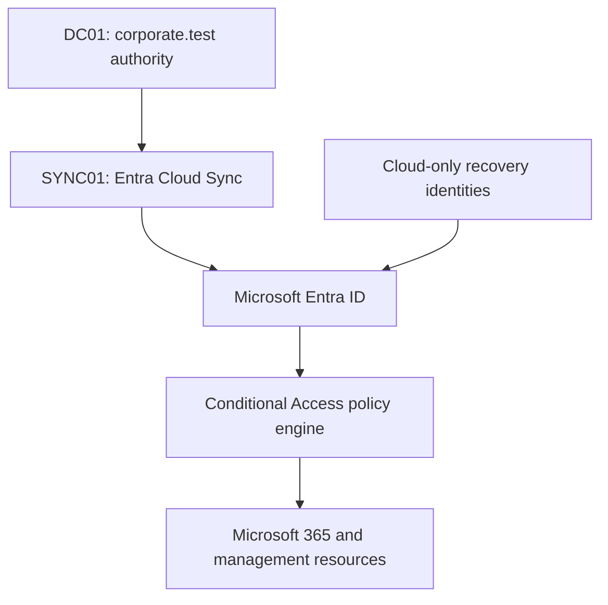
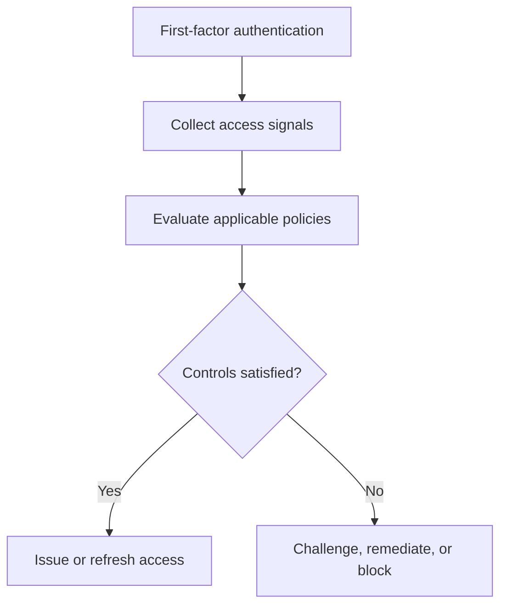
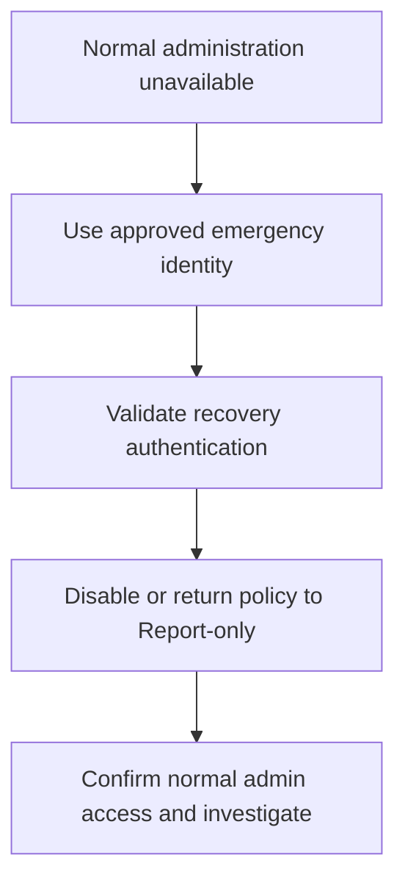
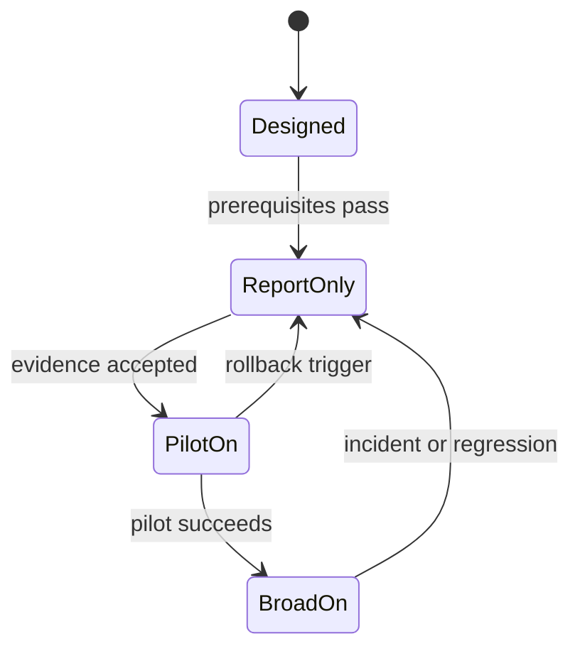
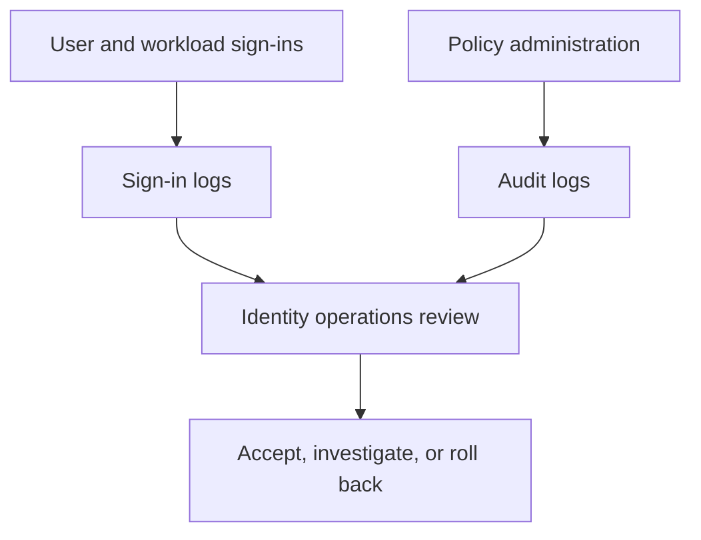

# Zero Trust Conditional Access Architecture

## 1. Architecture objective

The architecture places Microsoft Entra Conditional Access between an authenticated identity and a requested cloud resource. It uses identity, privilege, risk, client, session, and device signals to decide whether to block access, require stronger authentication, require remediation, require a compliant device, or constrain the session.

The design applies three Zero Trust principles:

- **Verify explicitly:** evaluate the user, role, resource, authentication method, sign-in risk, user risk, client type, and device state for each applicable request.
- **Use least privilege:** preserve existing authorization boundaries and apply stronger controls to privileged and sensitive cohorts.
- **Assume breach:** treat a valid password or existing session as insufficient evidence when risk or privilege raises the impact of compromise.

## 2. Identity and control-plane topology

### Component responsibilities

| Component | Responsibility | Trust boundary |
| --- | --- | --- |
| `DC01.corporate.test` | Authoritative source for scoped hybrid users, attributes, enabled state, and synchronized security groups | On-premises identity plane |
| `SYNC01.corporate.test` | Dedicated Cloud Sync agent for scoped users and groups with password-hash synchronization | Synchronization boundary |
| Microsoft Entra ID | Cloud identity, authentication, role, risk, device, and sign-in state | Cloud identity plane |
| Conditional Access | Evaluates applicable policies after first-factor authentication | Policy decision point |
| Target resources | Microsoft 365, Microsoft Admin Portals, Azure management, registration actions, and approved applications | Resource plane |
| Emergency access identities | Independent cloud-only administrative recovery path | Recovery plane, deliberately independent from on-premises synchronization |

Cloud Sync does not synchronize devices in this architecture. A device object, Intune management, and compliance evaluation are separate dependencies.

## 3. Access-decision path

### Signals and outcomes

| Signal | Example in this design | Possible outcome |
| --- | --- | --- |
| User population | All users, contractors, Finance access, HR access | Baseline or cohort-specific control applies |
| Directory role | Global Administrator or Conditional Access Administrator | Phishing-resistant MFA required |
| Target resource | All resources, admin portals, Azure management, Office 365 | Resource-specific policy applies |
| Client app | Modern browser or legacy client | Legacy client is blocked |
| Authentication flow | Interactive browser or device code flow | Device code flow is blocked unless a narrowly approved dependency exists |
| Authentication strength | MFA or phishing-resistant MFA | Stronger method required for privilege |
| Sign-in risk | Medium or High | Fresh MFA required every time |
| User risk | High | Risk remediation required when dependencies allow |
| Device state | Compliant or unmanaged | Sensitive access allowed or rejected |
| Session context | Contractor browser session | Persistent browser state disabled |

Conditional Access grants do not grant application permission. The existing IAM security groups continue to determine business authorization; Conditional Access determines the conditions under which that authorized access may be used.

## 4. Assignment architecture

### Verified existing groups

| Group | Members | Conditional Access use |
| --- | ---: | --- |
| `GG_IAM_All_Workforce` | 30 | Verified source cohort for pilot selection; not a substitute for final All users coverage |
| `GG_IAM_All_Employees` | 25 | Employee population validation |
| `GG_IAM_All_Contractors` | 5 | Contractor session-control assignment |
| `GG_IAM_Access_M365_Baseline` | 25 | Existing Microsoft 365 access cohort |
| `GG_IAM_Access_Finance_ERP` | 5 | Sensitive Finance cohort for deferred device-control design |
| `GG_IAM_Access_HR_Records` | 5 | Sensitive HR cohort for deferred device-control design |
| `GG_IAM_Department_InformationTechnology` | 5 | Source cohort for selecting an IT pilot user |

### Planned cloud-only control groups

| Group | Membership rule | Reason for cloud-only design |
| --- | --- | --- |
| `GG_CA_Exclude_EmergencyAccess` | Exactly two emergency accounts | Remains independent from on-premises failure and synchronization scope |
| `GG_CA_Pilot_Workforce` | Small approved set drawn from enabled IT, Finance, and contractor identities | Allows immediate policy-scope changes without modifying business entitlement groups |
| `GG_CA_Pilot_DeviceCompliance` | Only the isolated device-test identity | Prevents broad device-control impact |

Control groups do not change the meaning or membership of the 15 existing IAM authorization groups.

## 5. Recovery architecture

Recovery requirements:

1. Maintain at least two cloud-only emergency identities using the tenant's `onmicrosoft.com` domain.
2. Assign each identity the Global Administrator role permanently rather than through an activation-dependent workflow.
3. Keep them outside Cloud Sync, workforce groups, automated lifecycle actions, and ordinary administrative use.
4. Use phishing-resistant credentials that do not share the normal administrator dependency path.
5. Exclude the emergency group from enforced policies that could block or restrict access.
6. Alert on every sign-in, credential change, group change, and role change involving an emergency identity.
7. Test both identities at creation, immediately before enforcement changes, and at least every 90 days.
8. Keep the original policy configuration and change record available for controlled restoration after recovery.

The laboratory validates cloud-only identity separation and phishing-resistant Microsoft Authenticator passkeys. It does not prove that the recovery credentials and devices are independent from the routine administrator path. A production implementation must satisfy that additional separation requirement before treating the recovery design as fully independent.

## 6. Deployment-state architecture

| State | Meaning | Allowed action |
| --- | --- | --- |
| Designed | Documented but absent from the tenant | Review dependencies and test cases |
| Report-only | Evaluated without enforcing the control | Collect What If and sign-in evidence |
| Pilot On | Enforced for a small approved group | Run positive, negative, and recovery tests |
| Broad On | Enforced for the approved final population | Monitor continuously and review exclusions |
| Deferred | Required dependency is absent | Do not create or enforce until the gate is satisfied |

No policy moves directly from Designed to Broad On.

## 7. Dependency boundaries

| Dependency | Policies affected | Current design decision |
| --- | --- | --- |
| Entra ID P1 | CA001-CA005 and CA008-CA010; standard Conditional Access capability | Confirm entitlement for every identity benefiting from an assigned policy |
| Entra ID P2 | CA006 and CA007; Identity Protection user-risk and sign-in-risk signals | Activate in Milestone 3 only |
| MFA registration | CA002–CA007 | Measure and prepare pilot users before policy deployment |
| Phishing-resistant credential | CA003 | Register and test before privileged enforcement |
| Temporary Access Pass | CA005 and initial onboarding | Use as a controlled bootstrap, not a permanent authentication method |
| Cloud Sync password writeback | CA007 for synchronized users | Validate before user-risk remediation leaves Report-only |
| Intune and device compliance | CA008 | Deferred until an isolated managed-device path exists |
| Stable network ownership | Any location-based design | No trusted location created |
| Sign-in logging | Every policy | Required for impact analysis, investigation, and rollback decisions |
| Authentication-flow inventory | CA010 | Review device-code-flow sign-ins, protocol tracking, and Device Registration Service usage before enforcement |
| Microsoft-managed policies | Custom policies with equivalent scope | Inventory current state and scheduled enablement; document adopt, replace, or opt-out treatment before custom deployment |

## 8. Failure containment

- Emergency access is independent from `DC01` and `SYNC01`.
- Broad enforcement is prohibited until the emergency path and rollback operator are verified.
- CA007 cannot create a hybrid password-reset dead end because enforcement is gated on password writeback.
- CA008 cannot block the tenant's zero-device population because it remains deferred.
- Universal MFA has no application exclusions; exceptions are identity-specific, approved, monitored, and time-bound.
- CA004 provides transitional management-surface coverage and is retired after CA002 reaches verified broad enforcement, preventing permanent duplicate MFA controls.
- CA010 preserves the device-code-flow protection currently supplied by security defaults; any exception is resource-specific, owner-approved, monitored, and time-bound.
- Risk controls stay separate, so sign-in remediation can be tuned without changing high-user-risk handling.

## 9. Operational monitoring and handover architecture

| Operating boundary | Final implementation |
| --- | --- |
| Policy decision point | Five Wave 1 policies On for controlled pilot or contractor groups |
| Monitoring | Portal sign-in and audit logs with after-change, daily change-window, weekly, monthly, and 90-day reviews |
| Recovery | Two cloud-only emergency identities in a two-member exclusion group; independent credential and device separation remains a production limitation |
| Configuration integrity | Eleven successful setup and enforcement operations; zero deleted policies |
| Licence boundary | P2 Trial Active through 6 October 2026; recurring billing Off |
| Long-term analytics | Project-specific Log Analytics ingestion and the Insights and Reporting workbook remain outside scope |
| Privileged access | Four permanent Global Administrators observed; routine standing privilege deferred to the PIM project |

The [operations handover runbook](../runbooks/Conditional-Access-Operations-Handover-Runbook.md) assigns ownership and defines how sign-in evidence, audit changes, emergency access, rollback, and licence continuity are handled after implementation.

## 10. Microsoft Learn references

- [Conditional Access overview](https://learn.microsoft.com/en-us/entra/identity/conditional-access/overview)
- [Zero Trust guidance center](https://learn.microsoft.com/en-us/security/zero-trust/)
- [Plan a Conditional Access deployment](https://learn.microsoft.com/en-us/entra/identity/conditional-access/plan-conditional-access)
- [Manage emergency access accounts](https://learn.microsoft.com/en-us/entra/identity/role-based-access-control/security-emergency-access)
- [Control authentication flows](https://learn.microsoft.com/en-us/entra/identity/conditional-access/concept-authentication-flows)
- [Microsoft-managed Conditional Access policies](https://learn.microsoft.com/en-us/entra/identity/conditional-access/managed-policies)
- [Require device compliance](https://learn.microsoft.com/en-us/entra/identity/conditional-access/policy-all-users-device-compliance)
- [Conditional Access insights and reporting](https://learn.microsoft.com/en-us/entra/identity/conditional-access/howto-conditional-access-insights-reporting)
- [Microsoft Entra sign-in logs](https://learn.microsoft.com/en-us/entra/identity/monitoring-health/concept-sign-ins)
- [Microsoft Entra audit logs](https://learn.microsoft.com/en-us/entra/identity/monitoring-health/concept-audit-logs)
