# Conditional Access Controlled Enforcement and Operational Monitoring

## 1. Purpose

This document records Milestone 6 controlled enforcement of the five Wave 1 Microsoft Entra Conditional Access policies validated in Report-only during Milestone 5. It preserves the rollout sequence, safety gates, real sign-in outcomes, policy audit trail, recovery checks, limitations, and operational decision.

The milestone demonstrates controlled pilot enforcement in an isolated tenant populated with synthetic identities. It does not claim organization-wide production deployment.

## 2. Milestone status

**Status: Complete - all five Wave 1 policies were enabled sequentially, their mapped tests produced the expected decisions, both emergency identities retained access, and no rollback trigger occurred.**

| Policy | Final state | Enforcement evidence | Decision |
| --- | --- | --- | --- |
| `CA001-BLOCK-LegacyAuthentication-AllUsers` | On | Modern browser remained unaffected; enforced What If predicted Block for the legacy-client condition | Accepted with documented safe-test limitation |
| `CA004-GRANT-MFA-ManagementSurfaces-AllUsers` | On | Controlled Azure management sign-in required MFA and recorded Success | Accepted |
| `CA005-GRANT-MFA-SecurityInfoRegistration-AllUsers` | On | Controlled Security info access required MFA and recorded Success without changing a method | Accepted |
| `CA009-SESSION-NoPersistentBrowser-Contractors` | On | The session control recorded Success and the same local browser profile required a password after restart | Accepted |
| `CA010-BLOCK-DeviceCodeFlow-AllUsers` | On | A controlled device-code sign-in was denied and the enforced policy recorded Block with Failure | Accepted |

## 3. Safety boundary and change controls

- A separate Microsoft Edge InPrivate recovery session remained open throughout enforcement.
- Both cloud-only emergency identities authenticated before the first change and after all five policies were On.
- The emergency exclusion group contained exactly two direct members.
- Each policy moved from Report-only to On individually; no assignments, exclusions, target resources, conditions, or controls were changed during enforcement.
- A synthetic pilot identity was used for interactive tests.
- No real legacy client, weak credential, authentication-method deletion, or unprepared-user failure condition was manufactured for evidence.
- The operator reviewed the relevant sign-in result before enabling the next policy.
- Public screenshots were inspected for names, UPNs, GUIDs, tenant details, authentication codes, and other sensitive identifiers.

## 4. Observation-window decision

Microsoft recommends keeping each policy in Report-only for at least one week before enforcement and reviewing sign-in logs before progressing. This lab used a shorter observation window intentionally because it is an isolated, nonproduction tenant with synthetic identities, narrow pilot groups, two tested emergency identities, controlled test scenarios, and no observed business dependencies.

The shortened window is a documented lab exception, not a production rollout recommendation. A real organization should use an observation period appropriate to its user population, application estate, support model, and change-management requirements.

## 5. Pre-enforcement readiness and dependency review

The initial inventory showed five user-created policies, all in Report-only, and no Microsoft-managed policies.

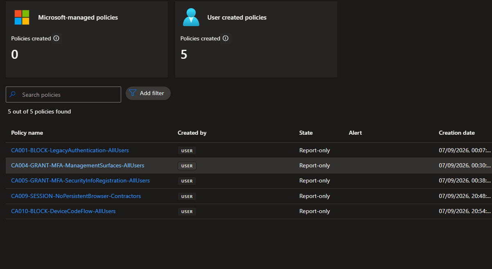

CA010 can disrupt legitimate device-registration workflows if device code flow is required. The Device Registration Service resource was therefore reviewed across the available one-month sign-in window with authentication protocol Device code. No matching interactive activity was found.

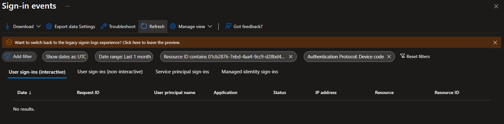

The same review was repeated for non-interactive sign-ins and returned no matching activity.

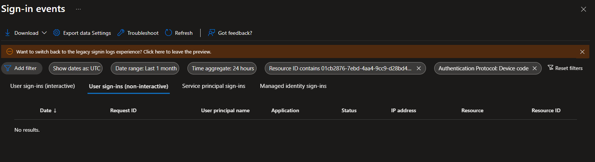

No resource exception was created because the available tenant evidence showed no dependency. This is an evidence-based lab decision, not proof that the service can be excluded from review in another tenant.

## 6. Sequential enforcement record

### 6.1 CA001 - block legacy authentication

CA001 was enabled first while the remaining Wave 1 policies stayed in Report-only.

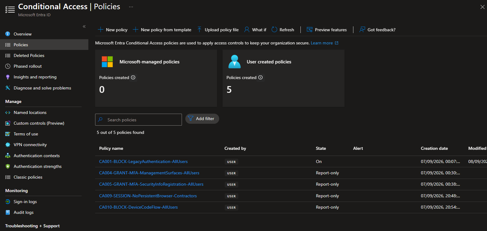

A fresh modern-browser sign-in succeeded and CA001 recorded Not applied, confirming that the client-app condition did not affect the supported browser path.

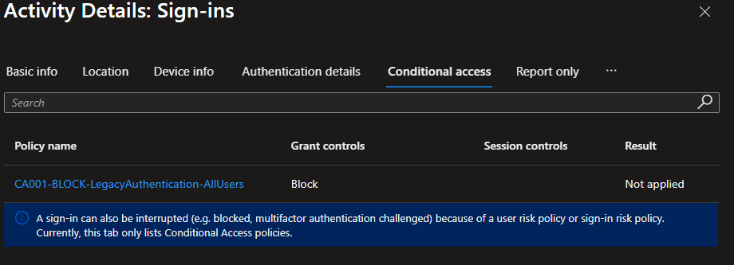

The policy-state change generated a successful Conditional Access audit event.

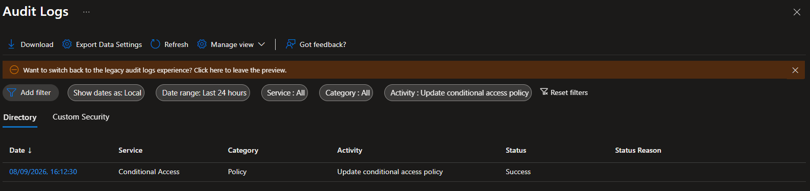

The What If tool was then run against the enforced state using the approved legacy-client classification. CA001 was applicable, its grant control was Block access, and its state was On.

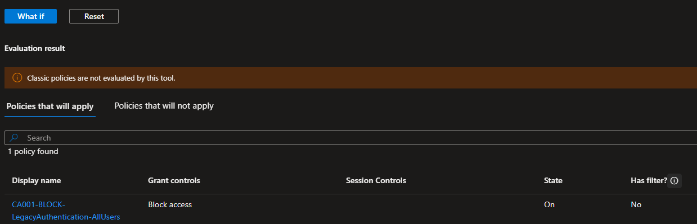

A real legacy-authentication attempt was not generated. The accepted evidence boundary is the enforced policy state, applicable enforced What If result, supported-browser negative test, and the previous one-month legacy-activity review. This avoids weakening authentication or introducing an obsolete client merely to manufacture a block event.

### 6.2 CA004 - require MFA for management surfaces

CA004 was enabled second; CA001 remained On and the other policies remained in Report-only.

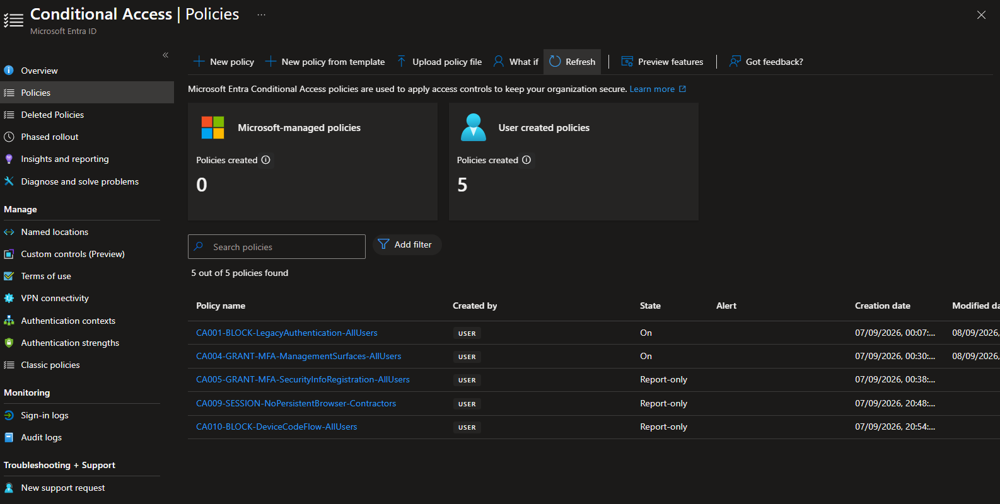

A fresh Azure Portal sign-in required MFA. The resulting event recorded CA004 as Success and CA001 as Not applied.

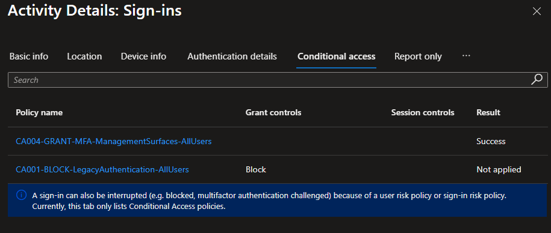

Success means the applicable grant requirement was satisfied; it does not mean the MFA requirement was bypassed.

### 6.3 CA005 - protect security-information registration

CA005 was enabled third.

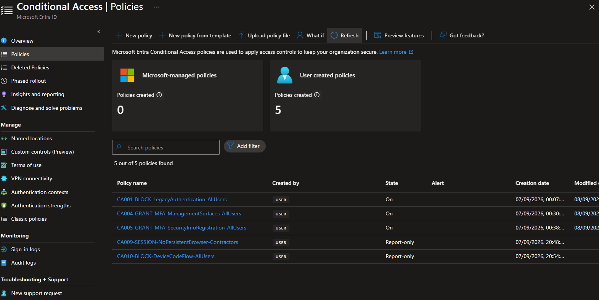

The prepared pilot identity opened Security info in a fresh browser session, completed the required MFA challenge, and made no authentication-method change. The sign-in record showed CA005 as Success.

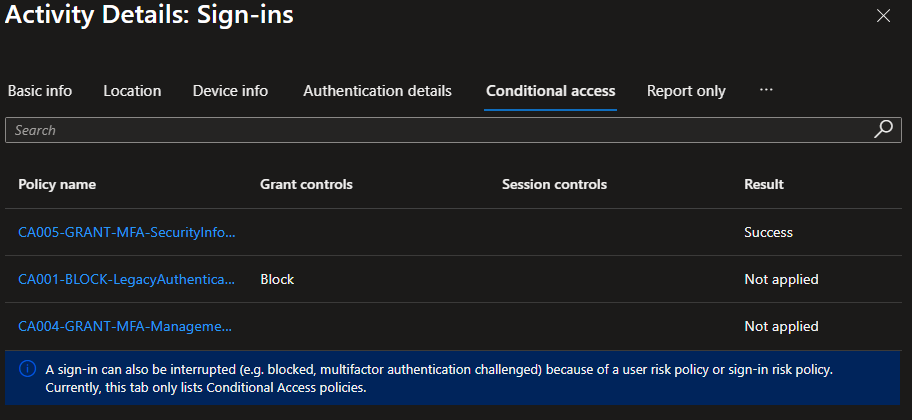

The unprepared-user failure path remains outside this milestone because no disposable unprepared identity and approved bootstrap procedure were available.

### 6.4 CA009 - prevent persistent contractor browser sessions

CA009 was enabled fourth while CA010 remained in Report-only.

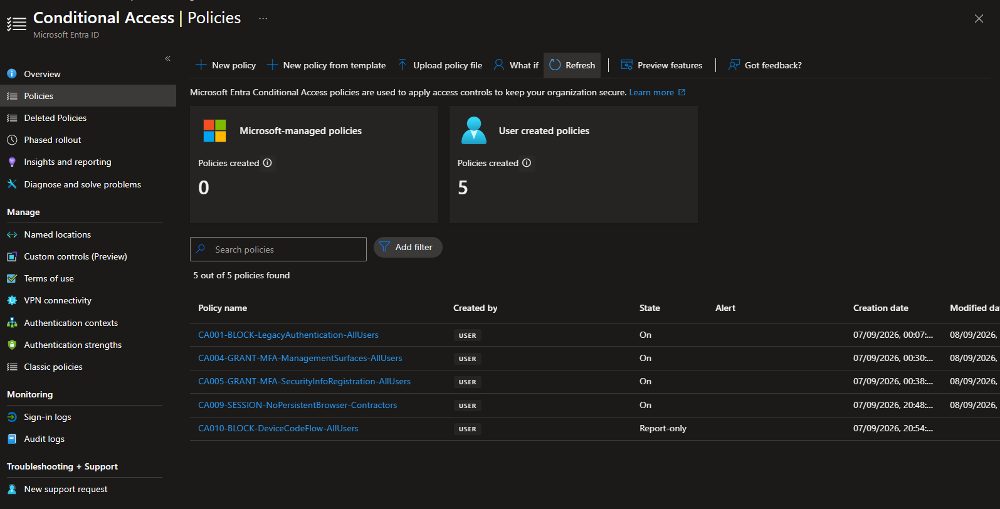

A dedicated local Chrome profile was used because an Incognito window always discards its session and cannot prove the Conditional Access behavior. The contractor identity completed a fresh sign-in and MFA challenge. The Stay signed in prompt was not presented. After every window belonging to that profile was closed and the same profile reopened, Microsoft displayed the account picker and required the password again.

The corresponding sign-in record showed `PersistentBrowserSessionMode` and Success for CA009.

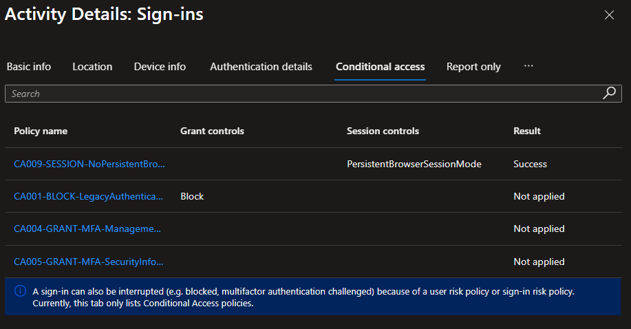

The account-picker screenshot contained the test UPN and is retained only as private lab evidence. The public record instead combines the sanitized Conditional Access result with the controlled behavioral observation in [`data/m06-controlled-enforcement-validation.txt`](../data/m06-controlled-enforcement-validation.txt).

### 6.5 CA010 - block device code flow

CA010 was enabled last. The resulting inventory showed all five Wave 1 policies On.

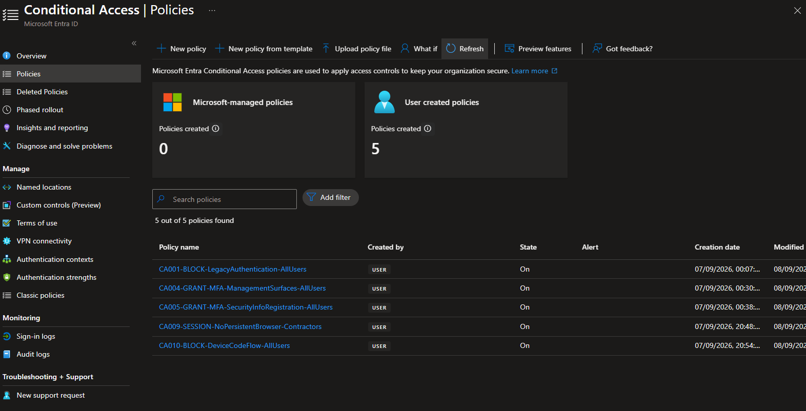

A fresh Microsoft Graph PowerShell authentication requested device code flow for the synthetic pilot identity. The browser accepted the primary authentication but denied resource access because the authentication flow did not meet the administrator's policy criteria. The UPN is visibly redacted in the public derivative.

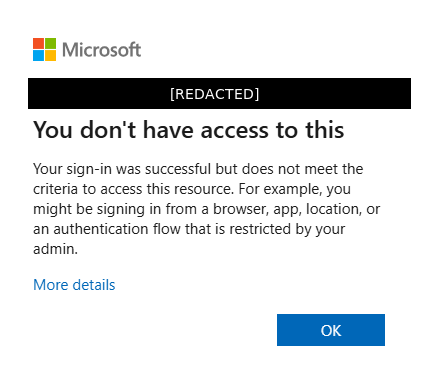

The authoritative sign-in record showed CA010 with grant control Block and result Failure. For this enforced block policy, Failure is the expected policy result: the request matched CA010 and access was denied. The secondary PowerShell listener error was not used as authoritative evidence.

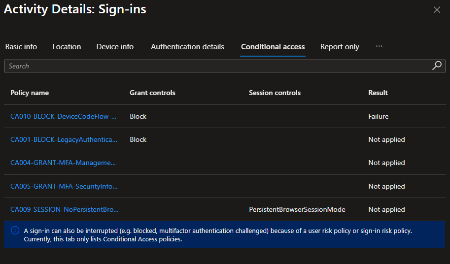

## 7. Operational monitoring and audit trail

The audit log was filtered to `Update conditional access policy` for the enforcement window. Five successful events were present, matching the five sequential state changes.

| Portal local time | Recorded change outcome |
| --- | --- |
| 16:12:30 | Successful Conditional Access policy update |
| 16:33:58 | Successful Conditional Access policy update |
| 16:58:32 | Successful Conditional Access policy update |
| 17:10:13 | Successful Conditional Access policy update |
| 17:28:29 | Successful Conditional Access policy update |

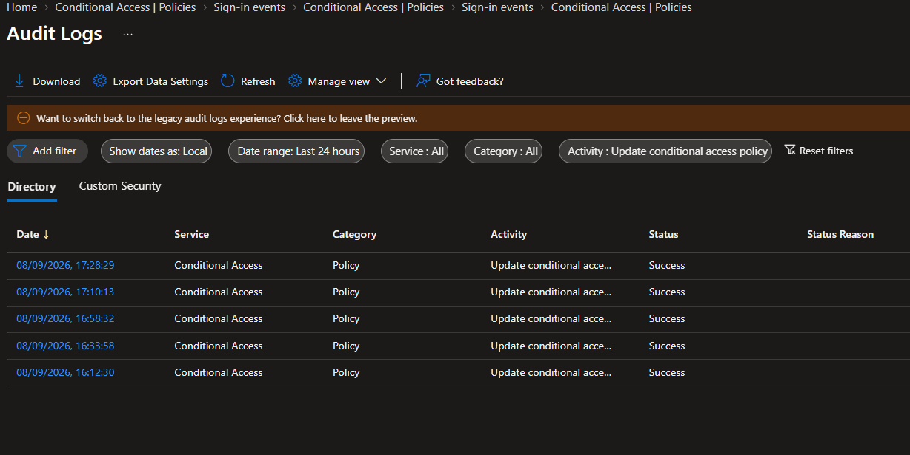

Operational monitoring for this scope uses:

- Sign-in logs to confirm policy application, nonapplication, grant results, and session controls.
- Audit logs to identify policy changes and successful administrative operations.
- Authentication protocol and resource filters to detect device-code activity and unexpected dependencies.
- Periodic emergency-account tests and exclusion-group membership review.
- Immediate rollback when a documented trigger is observed.

## 8. Recovery assurance and least-privilege finding

Both emergency identities successfully opened the Microsoft Entra admin center after all policies were enabled. Their names, UPNs, role-assignment details, and group-membership screenshots remain private.

The readiness review also found four permanent-active Global Administrator assignments: the two emergency identities and two additional administrative principals. That exceeds the intended steady-state privileged-access model. It did not block this lab's Conditional Access enforcement because removing standing administrators during the same change window would combine unrelated high-impact changes.

The finding is accepted temporarily and must be remediated in the planned Privileged Identity Management project by reducing routine standing Global Administrator access, using eligible just-in-time assignments where appropriate, and retaining only the independently governed emergency identities as permanent recovery paths.

No rollback was invoked because every expected result matched and both recovery paths remained available. The documented rollback procedure remained ready throughout the change window.

## 9. Scenario disposition

| Scenario | Milestone 6 disposition | Outcome |
| --- | --- | --- |
| TS-01 | Enforced What If and supported-browser negative test completed; no real legacy client introduced | Passed with safe-test limitation |
| TS-02 | Modern browser sign-in remained unaffected by CA001 | Passed |
| TS-09 | Azure management sign-in required MFA and CA004 recorded Success | Passed |
| TS-10 | Prepared-user Security info access required MFA and CA005 recorded Success | Passed |
| TS-11 | No disposable unprepared user was used | Deferred |
| TS-18 | Dedicated browser profile required a password after restart; CA009 recorded session-control Success | Passed |
| TS-20 | Both emergency identities retained access after enforcement | Passed |
| TS-23 | Controlled device-code sign-in was blocked and CA010 recorded Failure | Passed |
| TS-24 | Earlier normal-browser evaluation showed CA010 nonapplicable | Passed |
| TS-25 | Microsoft-managed policy inventory remained zero | Passed |
| TS-26 | Emergency membership, role state, and pre/post-enforcement access were verified | Passed; private identity evidence retained |

TS-22 was not invoked because no rollback trigger occurred. Recovery capability was verified through an independent administrator session and successful post-enforcement emergency sign-ins rather than reversing a correctly functioning policy solely for evidence.

## 10. Final state and operational decision

Milestone 6 is complete for the approved controlled scope:

- Five Wave 1 policies are On.
- Five successful policy-update audit events are recorded.
- CA004 and CA005 enforced their MFA requirements successfully.
- CA009 prevented reuse of the persistent browser session in the controlled test.
- CA010 blocked a real device-code sign-in.
- CA001 remained transparent to modern browser access and predicted Block for the enforced legacy-client case.
- Both emergency identities retained administrator access.
- No unexpected application, dependency, or rollback trigger was observed.

This outcome authorizes Milestone 7 operational handover and final assurance. It does not authorize expansion beyond the documented pilot and contractor scopes. CA002, CA003, CA006, CA007, and CA008 remain design-only and require their own prerequisites and rollout evidence.

## 11. Authoritative references

- [Plan a Conditional Access deployment](https://learn.microsoft.com/en-us/entra/identity/conditional-access/plan-conditional-access)
- [Use report-only mode](https://learn.microsoft.com/en-us/entra/identity/conditional-access/concept-conditional-access-report-only)
- [Conditional Access What If](https://learn.microsoft.com/en-us/entra/identity/conditional-access/what-if-tool)
- [Microsoft Entra sign-in logs](https://learn.microsoft.com/en-us/entra/identity/monitoring-health/concept-sign-ins)
- [Microsoft Entra audit logs](https://learn.microsoft.com/en-us/entra/identity/monitoring-health/concept-audit-logs)
- [Block legacy authentication](https://learn.microsoft.com/en-us/entra/identity/conditional-access/policy-block-legacy-authentication)
- [Require MFA for Azure management](https://learn.microsoft.com/en-us/entra/identity/conditional-access/policy-old-require-mfa-azure-mgmt)
- [Protect security-information registration](https://learn.microsoft.com/en-us/entra/identity/conditional-access/policy-all-users-security-info-registration)
- [Require reauthentication and disable browser persistence](https://learn.microsoft.com/en-us/entra/identity/conditional-access/policy-all-users-persistent-browser)
- [Authentication flows as a Conditional Access condition](https://learn.microsoft.com/en-us/entra/identity/conditional-access/concept-authentication-flows)
- [Manage emergency access accounts](https://learn.microsoft.com/en-us/entra/identity/role-based-access-control/security-emergency-access)
- [Plan a Privileged Identity Management deployment](https://learn.microsoft.com/en-us/entra/id-governance/privileged-identity-management/pim-deployment-plan)
