# Conditional Access Operational Handover and Final Assurance

## 1. Purpose

This document closes the controlled Conditional Access rollout by confirming the final policy state, recovery readiness, post-enforcement monitoring, change integrity, licence continuity, operational ownership, accepted findings, and deferred work.

The assurance decision applies to the isolated synthetic lab and the documented Wave 1 pilot and contractor populations. It does not claim organization-wide production deployment.

## 2. Final assurance decision

**Status: Complete - the five Wave 1 policies remain On, both emergency identities passed final access tests, monitoring found no unexpected Conditional Access failure or policy change, no policies are deleted, and the operational handover controls are documented.**

| Assurance area | Final result |
| --- | --- |
| Policy state | 5 user-created policies On; 0 Microsoft-managed policies |
| Recovery | Both cloud-only emergency identities passed final Entra admin-center access tests |
| Controlled scope | 3 direct workforce-pilot members, 5 direct contractor members, and 2 direct emergency-exclusion members |
| Sign-in monitoring | 1 Conditional Access failure in 7 days; it was the expected CA010 device-code block; 0 unexpected failures |
| Change integrity | 1 successful security-default transition, 5 successful policy creations, 5 successful enforcement updates, and 0 failed or unexplained changes |
| Deletion integrity | 0 deleted Conditional Access policies |
| Licensing | Entra ID P2 Trial Active; 7/100 assigned; expires 6 October 2026; recurring billing Off |
| Known privilege finding | 4 permanent-active Global Administrators; 2 routine assignments deferred to the planned PIM implementation |
| Final disposition | Operational handover accepted for the controlled lab scope |

## 3. Final policy inventory

The final inventory contains the same five approved Wave 1 policies, all On. No Microsoft-managed policy is present in the recorded view.

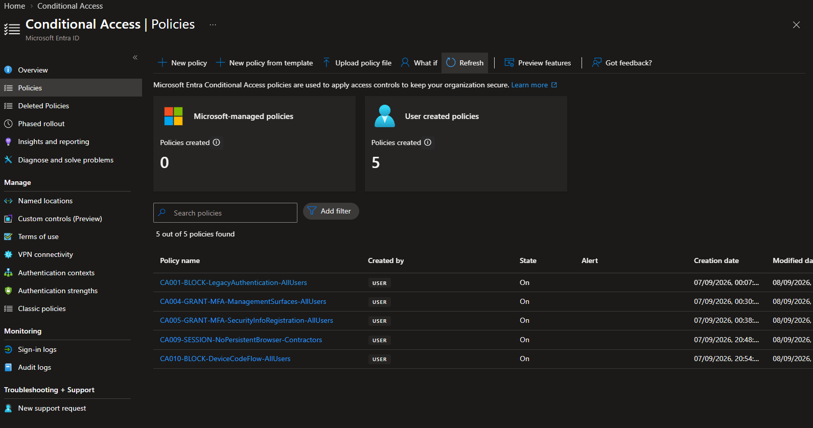

| Policy | Final state | Controlled assurance outcome |
| --- | --- | --- |
| `CA001-BLOCK-LegacyAuthentication-AllUsers` | On | Modern browser unaffected; enforced What If predicted Block for the legacy-client condition |
| `CA004-GRANT-MFA-ManagementSurfaces-AllUsers` | On | Management access required MFA and recorded Success |
| `CA005-GRANT-MFA-SecurityInfoRegistration-AllUsers` | On | Security-info access required MFA and recorded Success |
| `CA009-SESSION-NoPersistentBrowser-Contractors` | On | Session control succeeded and the controlled profile required reauthentication |
| `CA010-BLOCK-DeviceCodeFlow-AllUsers` | On | Controlled device-code sign-in was blocked as designed |

## 4. Post-enforcement sign-in assurance

The seven-day Conditional Access failure review returned one event. It was the expected Microsoft Graph device-code attempt already validated against CA010. Error `53003` and the enforced CA010 Failure result represent the intended access denial. No other Conditional Access failure appeared.

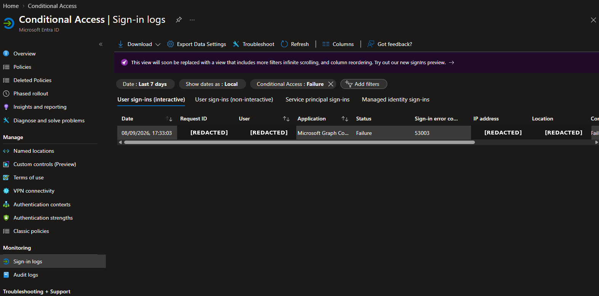

The corresponding success review showed successful Conditional Access outcomes for Azure Portal, My Sign-ins, My Profile, and Microsoft Account resources. Intermediate status `Interrupted` with code `50140` is the Microsoft Entra Keep me signed in interrupt; successful events followed it. It is not classified as an unexpected Conditional Access policy failure.

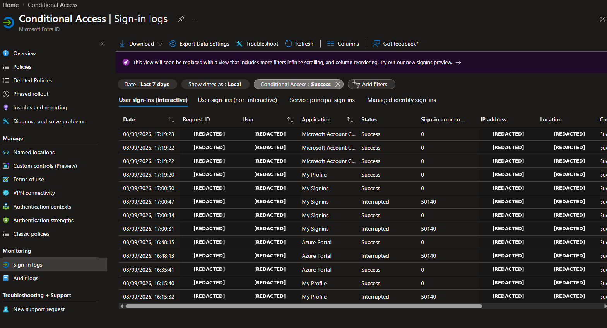

## 5. Change and deletion integrity

The seven-day audit review contains eleven successful Conditional Access operations: the documented security-defaults transition, five policy creations, and five sequential enforcement updates. No failed or unexplained change appears.

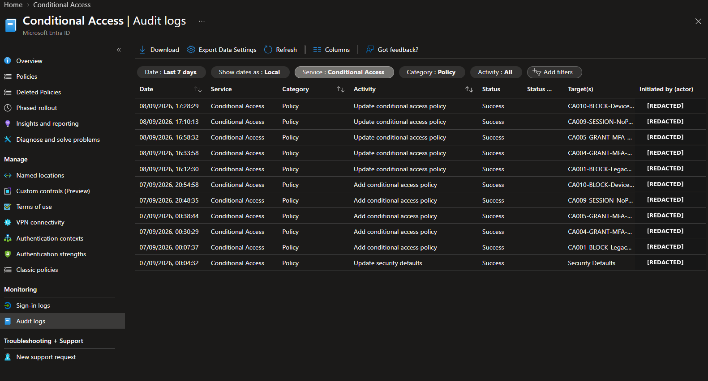

The deleted-policy inventory returned zero results. This confirms that no policy was accidentally removed during the recorded project window.

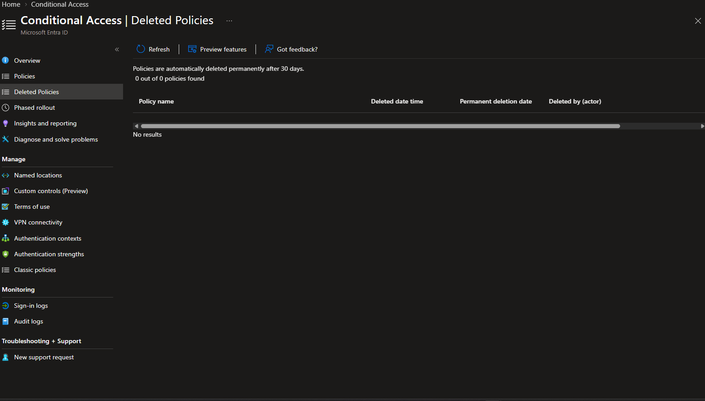

Microsoft retains deleted Conditional Access policies for a 30-day soft-delete period. Restoration remains an exceptional recovery option; returning a policy to Report-only is the standard project rollback action.

## 6. Licence continuity

The final licence-assignment review showed 7 of 100 Entra ID P2 licences assigned to the controlled population. Entra ID P1 is the baseline licence for standard Conditional Access, while the risk-based CA006 and CA007 designs require P2. The P2 trial includes P1 capability, but the published count does not map each licence to every CA009 contractor member; that mapping requires live-tenant reconciliation.

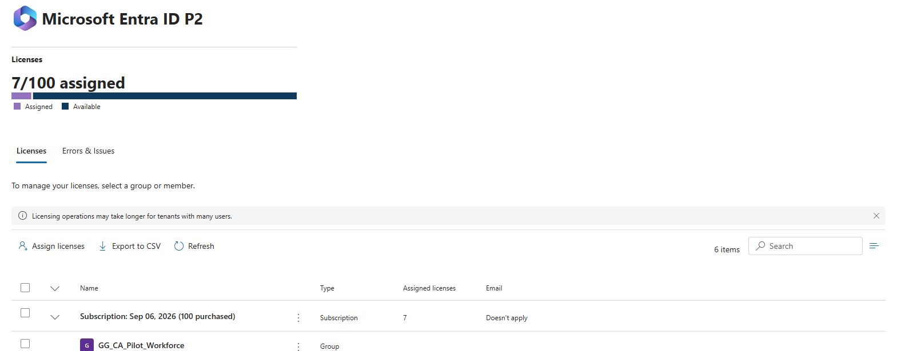

The billing inventory showed the P2 Trial Active, 100 purchased trial seats, 93 available seats, and expiration on 6 October 2026.

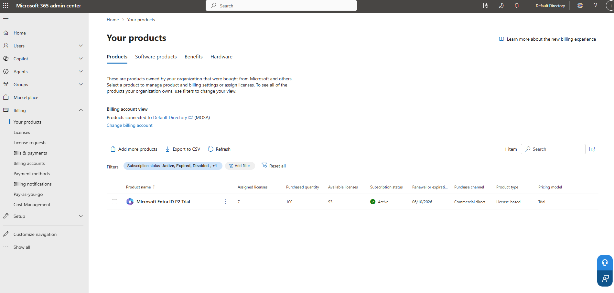

The subscription details confirmed recurring billing Off and the same expiration date.

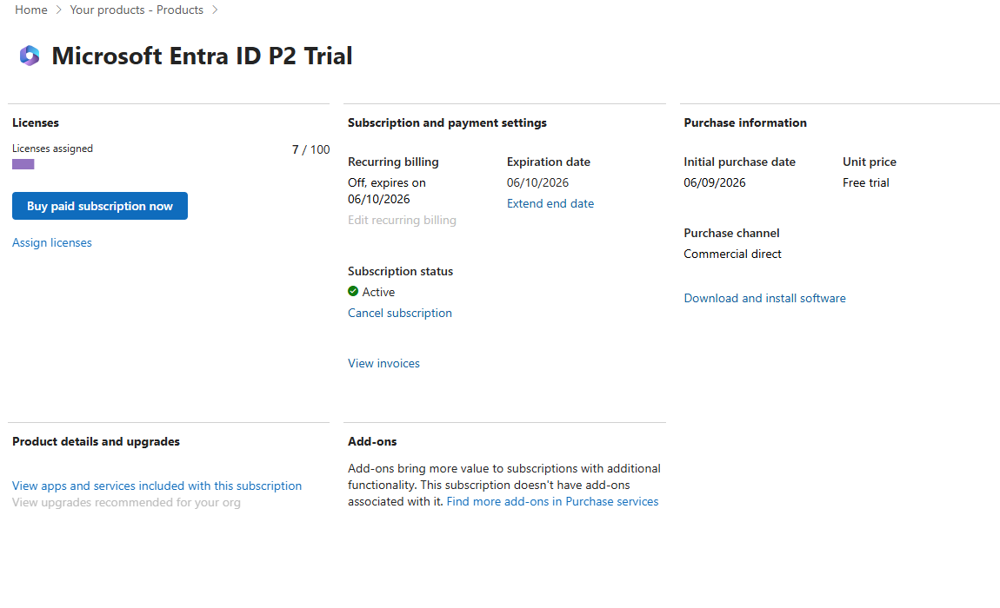

This is an explicit operational dependency. The project remains valid as evidence of the implemented lab, but continuing premium operations beyond the expiry date requires a new licensing decision and validation.

## 7. Recovery, scope, and privilege assurance

The emergency exclusion group contains exactly two direct members. The identities are redacted in public evidence; both independently opened the Microsoft Entra admin center during final assurance.

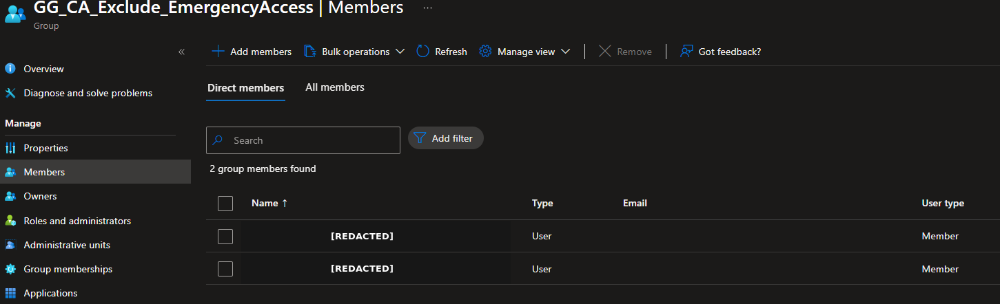

The controlled workforce pilot contains exactly three direct members.

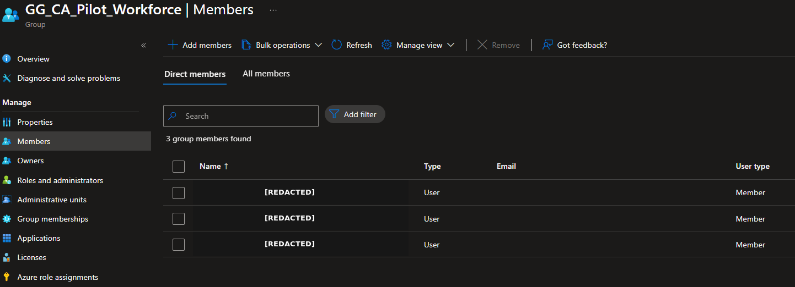

The contractor group used by CA009 contains exactly five direct members.

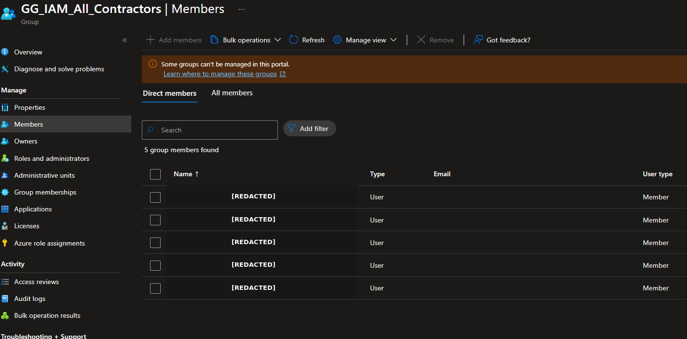

The privileged-role review showed four direct, assigned, permanent Global Administrator entries. Two are the required emergency recovery identities. The other two standing assignments remain a least-privilege finding and are deferred to the planned Microsoft Entra PIM project so that privileged-role redesign is not combined with the Conditional Access change window.

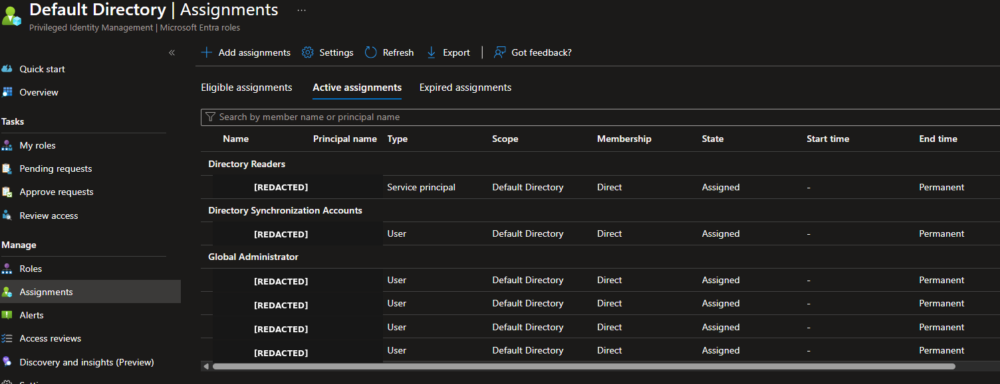

## 8. Operational handover model

The [operations handover runbook](../runbooks/Conditional-Access-Operations-Handover-Runbook.md) defines:

- policy, monitoring, recovery, application, and licence ownership;
- after-change, daily, weekly, monthly, and 90-day review activities;
- sign-in triage and expected-interruption handling;
- controlled policy change and scope-expansion gates;
- emergency access and rollback procedures;
- licence-expiry ownership;
- privacy rules for public evidence.

The [operational control register](../data/m07-operational-control-register.csv) maps every enforced policy to its current scope, control, monitoring signal, rollback action, owner, cadence, and assurance result.

## 9. Accepted limitations and deferred work

| Item | Final treatment |
| --- | --- |
| Shortened Report-only observation | Accepted only for this isolated synthetic lab; not production-equivalent |
| Real legacy-client block | Not manufactured; enforced What If, supported-browser nonapplication, and activity review are the accepted safe evidence boundary |
| Unprepared registration user | Not created solely to produce failure evidence |
| Insights and Reporting workbook | Not implemented; portal sign-in and audit reviews used; production requires Log Analytics ingestion and ownership |
| Four permanent Global Administrators | Recorded as least-privilege finding; routine standing assignments deferred to the PIM project |
| Security-defaults replacement coverage | Security defaults is Off while CA002 remains design-only; assurance covers the tested Wave 1 groups and does not prove equivalent protection for every other enabled identity |
| Contractor licence mapping | Seven P2 assignments are evidenced, but one-to-one P1-or-higher entitlement for all five CA009 members is not established by the public evidence |
| Emergency-authentication independence | Authenticator passkeys provide phishing resistance, but use of the same application or device dependency as routine administration would not meet a production-grade independent recovery design |
| CA002, CA003, CA006, CA007, CA008 | Remain design-only and require their own prerequisites, report-only review, testing, and approval |
| P2 trial expiration | Must be reviewed before 6 October 2026; recurring billing is Off |

## 10. Handover acceptance

The following artifacts form the final operating package:

- [Conditional Access Policy Matrix](../policies/Conditional-Access-Policy-Matrix.md)
- [Zero Trust Conditional Access Architecture](../architecture/Zero-Trust-Conditional-Access-Architecture.md)
- [Conditional Access Test and Rollback Plan](../runbooks/Conditional-Access-Test-and-Rollback-Plan.md)
- [Conditional Access Operations Handover Runbook](../runbooks/Conditional-Access-Operations-Handover-Runbook.md)
- [Operational Control Register](../data/m07-operational-control-register.csv)
- [Milestone 7 Final Assurance Record](../data/m07-final-assurance-validation.txt)
- [Conditional Access Implementation Lessons Learned](Conditional-Access-Lessons-Learned.md)

All required Milestone 7 evidence is present, the public evidence set contains no published sensitive identifier, and the final technical review passed. The implementation is complete for its documented controlled-lab scope.

## 11. Authoritative references

- [Plan a Conditional Access deployment](https://learn.microsoft.com/en-us/entra/identity/conditional-access/plan-conditional-access)
- [Conditional Access insights and reporting](https://learn.microsoft.com/en-us/entra/identity/conditional-access/howto-conditional-access-insights-reporting)
- [Microsoft Entra sign-in logs](https://learn.microsoft.com/en-us/entra/identity/monitoring-health/concept-sign-ins)
- [Microsoft Entra audit logs](https://learn.microsoft.com/en-us/entra/identity/monitoring-health/concept-audit-logs)
- [Microsoft Entra authentication error codes](https://learn.microsoft.com/en-us/entra/identity-platform/reference-error-codes)
- [Manage emergency access accounts](https://learn.microsoft.com/en-us/entra/identity/role-based-access-control/security-emergency-access)
- [Microsoft Graph policy soft-delete resource](https://learn.microsoft.com/en-us/graph/api/resources/policydeletableitem?view=graph-rest-beta)
- [Microsoft Entra licensing](https://learn.microsoft.com/en-us/entra/fundamentals/licensing)
