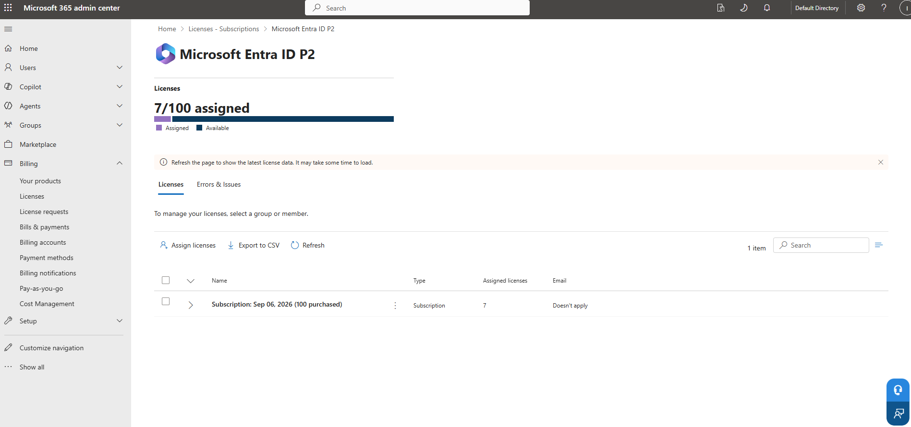
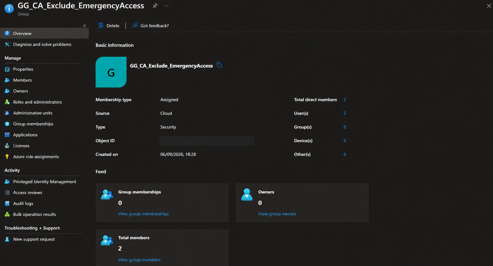
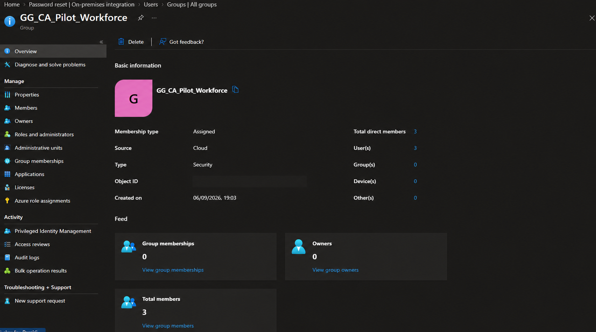
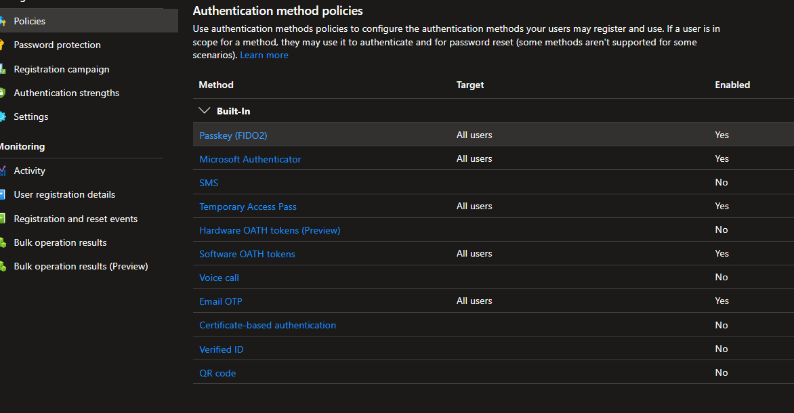
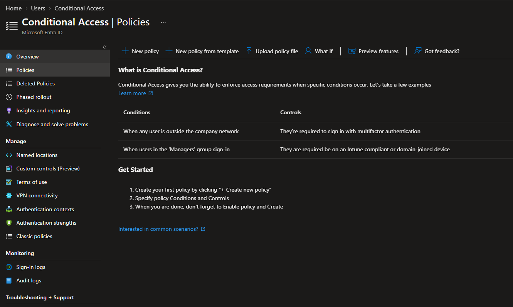
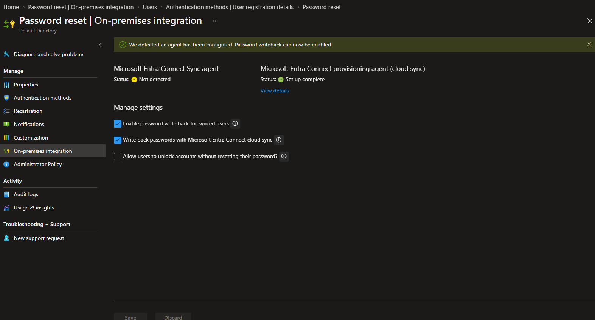

# Conditional Access Prerequisite and Licensed-Feature Readiness

## 1. Purpose

This document records the controlled prerequisite work completed before Conditional Access policy deployment. It verifies licensing, recovery access, pilot scope, authentication readiness, policy inventory, and hybrid password-recovery dependencies without enabling any Conditional Access policy.

The milestone keeps Microsoft Entra security defaults enabled. Report-only policy creation begins in Milestone 4 after the completed readiness package is installed and validated.

Each evidence item is placed directly beneath the readiness activity it validates. Only the minimum state required to support the documented claim is published; duplicate troubleshooting screens, billing details, account identifiers, user principal names, service-account names, and unsuccessful sign-in data remain local.

## 2. Milestone status

**Status: Complete — prerequisite configuration, password writeback, policy restoration, and fresh sign-in validation passed.**

| Readiness area | Observed state | Decision |
| --- | --- | --- |
| Microsoft Entra ID P2 | Active trial with 100 licences; 7 assigned to the controlled test population | P1 Conditional Access capability and P2 Identity Protection capability are available to appropriately licensed test identities |
| Security defaults | Enabled | Retain until replacement Conditional Access controls are ready for their documented cutover |
| Conditional Access inventory | No custom or Microsoft-managed policies visible at the post-licensing inventory checkpoint | Use the approved custom-policy matrix; repeat the inventory immediately before deployment |
| Emergency recovery | Dedicated cloud security group with exactly 2 direct cloud-only emergency identities | Preserve as the governed exclusion and recovery boundary |
| Emergency authentication | Both emergency identities hold permanent-active Global Administrator assignments, use Microsoft Authenticator passkeys, and completed successful sign-in tests | Reconfirm immediately before enforcement and at least every 90 days |
| Workforce pilot | Dedicated cloud security group with exactly 3 direct members representing IT, Finance, and contractor cohorts | Use only for controlled validation where the policy matrix specifies pilot scope |
| Pilot authentication | All 3 pilot identities registered Microsoft Authenticator and completed successful sign-ins | Ready for MFA-dependent Report-only evaluation |
| Authentication methods | Passkey (FIDO2), Microsoft Authenticator, and Temporary Access Pass are enabled | Use built-in authentication strengths; do not require physical FIDO2 keys in this lab |
| Password reset scope | SSPR enabled for the workforce pilot group | Keep the recovery test population narrow |
| Cloud Sync password writeback | Portal controls enabled, on-premises Cloud Sync service-account permissions applied, and functional writeback observed | Password-recovery dependency is ready for controlled policy testing |
| Privileged phishing-resistant readiness | Emergency identities are ready; the 2 everyday administrator identities have not completed phishing-resistant registration | Keep CA003 in Report-only until those administrators are prepared |
| Device compliance | No Intune-managed compliant pilot device exists | Keep CA008 design-only and do not create it in Milestone 4 |

## 3. Licensed-feature activation

Microsoft Entra ID P2 was activated only after the Milestone 2 design, exclusions, recovery model, and test plan were approved. The tenant provides 100 trial licences and recurring billing is disabled. The observed allocation is deliberately limited to 7 identities:

- 3 workforce pilot users through `GG_CA_Pilot_Workforce`
- 2 cloud-only emergency-access identities
- 2 everyday administrator identities

This allocation supports Conditional Access, risk-policy, recovery, and administrative testing without licensing the full synthetic directory population.

Standard Conditional Access requires Entra ID P1. The risk-based CA006 and CA007 designs require the Identity Protection capability in Entra ID P2. Because the P2 allocation contains the P1 entitlement, the trial is technically sufficient for assigned users; the final review must still reconcile licence assignment against every identity targeted by an enforced policy.

## 4. Recovery boundary

`GG_CA_Exclude_EmergencyAccess` is an assigned, cloud-only security group with exactly 2 direct user members. Both identities are cloud-only and therefore independent of on-premises Active Directory and Cloud Sync availability.

Each emergency identity:

- holds a permanent-active Global Administrator assignment;
- uses a passkey registered through Microsoft Authenticator;
- completed a successful authentication test after creation;
- is excluded from restrictive Conditional Access policies where the approved matrix requires recovery access;
- is reserved for emergency recovery rather than routine administration; and
- must be retested immediately before enforcement and at least every 90 days.

Individual account names, user principal names, object identifiers, credential details, and sign-in-session data are intentionally excluded from public evidence.

## 5. Pilot population

`GG_CA_Pilot_Workforce` is an assigned, cloud-only security group with exactly 3 direct user members. The members were selected from separate synthetic workforce cohorts:

- Information Technology employee
- Finance employee
- Contractor

All three identities registered Microsoft Authenticator and completed successful sign-ins. The pilot group is also the selected SSPR population. Broad user assignment remains prohibited until the relevant Report-only results and failure paths have been reviewed.

## 6. Authentication readiness

The authentication-method policy confirms that Passkey (FIDO2), Microsoft Authenticator, and Temporary Access Pass are enabled. The lab uses passkeys in Microsoft Authenticator and does not depend on separately purchased physical security keys.

This meets the laboratory's phishing-resistant test objective, but it does not demonstrate full production recovery-path independence. If normal and emergency administrators rely on the same Authenticator application, mobile device, or recovery dependency, a shared failure can affect both paths. A production design should use separately controlled credentials and devices, avoid employee-supplied devices, and store recovery credentials independently.

The built-in Multifactor authentication strength remains the baseline for general MFA controls. The built-in Phishing-resistant MFA strength is reserved for privileged-access policy evaluation. Because the everyday administrator identities have not yet registered phishing-resistant credentials, `CA003-GRANT-PhishingResistantMFA-AdminRoles` must remain Report-only until that dependency passes.

## 7. Conditional Access inventory

After P2 activation, the Conditional Access policy page became available. No custom or Microsoft-managed Conditional Access policies were visible at the recorded checkpoint.

The inventory result establishes a clean pre-deployment baseline, not a permanent assumption. The policy page must be checked again immediately before Milestone 4 because Microsoft-managed policy state can change after licensing or tenant-service evaluation.

No Conditional Access policy was created, enabled, disabled, or deleted during Milestone 3.

## 8. Hybrid SSPR and password writeback

SSPR is scoped to `GG_CA_Pilot_Workforce`. In the on-premises integration configuration:

- **Enable password write back for synced users** is selected.
- **Write back passwords with Microsoft Entra Connect cloud sync** is selected.
- The Microsoft Entra Connect provisioning agent reports **Set up complete**.

The Cloud Sync provisioning service is configured for automatic startup and was verified running. The synchronization configuration returned to a healthy state after the agent was restarted. Required password-writeback permissions were applied to the Cloud Sync group managed service account by using the supported Microsoft Cloud Sync PowerShell module and on-premises enterprise administrator credentials.

The on-premises default domain password policy has a one-day minimum password age. During same-day testing, the minimum was temporarily set to zero inside a protected `try`/`finally` workflow and restored to one day after every attempt.

Initial SSPR attempts proved authentication-method verification but did not submit a password change and therefore did not update the on-premises `PasswordLastSet` value. Microsoft documents that newly applied Cloud Sync service-account permissions can require an hour or longer to propagate. These attempts are treated only as troubleshooting activity and are not represented as successful password resets.

### Functional validation result

A final controlled test used a supported administrator-initiated reset from the Microsoft Entra admin center, followed immediately by the pilot user's required password change and Microsoft Authenticator sign-in. The test proved all of the following:

1. Microsoft Entra confirmed the administrative password reset.
2. The temporary password was immediately replaced by the user and was not retained as evidence.
3. The on-premises `PasswordLastSet` value advanced.
4. The temporary minimum-password-age change was restored to one day.
5. Successful writeback demonstrated that the Cloud Sync provisioning path was operational.
6. A fresh sign-in succeeded using the new password and Microsoft Authenticator.

The sanitized result is stored in [`data/m03-password-writeback-validation.txt`](../data/m03-password-writeback-validation.txt). No password, user principal name, object identifier, service-account name, or authentication-session data is published.

## 9. Milestone 3 exit decision

The licensed tenant, emergency boundary, pilot population, authentication-method policy, Conditional Access inventory, and hybrid password-recovery path are ready. Security defaults remains enabled, no Conditional Access policy has been deployed, CA008 remains design-only, and CA003 remains Report-only until routine administrators have phishing-resistant credentials.

**Milestone 3 is complete. Milestone 4 can begin with the approved policies in Report-only mode while the documented CA003 and CA008 dependencies remain enforced.**

## 10. Authoritative references

- [Plan a Conditional Access deployment](https://learn.microsoft.com/en-us/entra/identity/conditional-access/plan-conditional-access)
- [Microsoft Entra security defaults](https://learn.microsoft.com/en-us/entra/fundamentals/security-defaults)
- [Manage emergency access accounts](https://learn.microsoft.com/en-us/entra/identity/role-based-access-control/security-emergency-access)
- [Manage authentication methods](https://learn.microsoft.com/en-us/entra/identity/authentication/how-to-authentication-methods-manage)
- [Passkeys in Microsoft Authenticator](https://learn.microsoft.com/en-us/entra/identity/authentication/how-to-enable-authenticator-passkey)
- [Enable self-service password reset](https://learn.microsoft.com/en-us/entra/identity/authentication/tutorial-enable-sspr)
- [Enable Cloud Sync SSPR password writeback](https://learn.microsoft.com/en-us/entra/identity/authentication/tutorial-enable-cloud-sync-sspr-writeback)
- [Troubleshoot Microsoft Entra Cloud Sync](https://learn.microsoft.com/en-us/entra/identity/hybrid/cloud-sync/how-to-troubleshoot)
- [Microsoft-managed Conditional Access policies](https://learn.microsoft.com/en-us/entra/identity/conditional-access/managed-policies)
- [Microsoft Entra licensing](https://learn.microsoft.com/en-us/entra/fundamentals/licensing)
