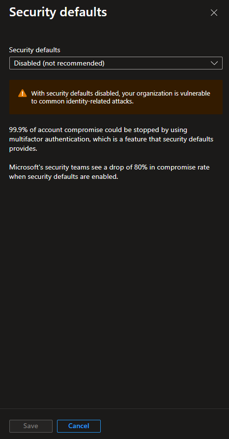
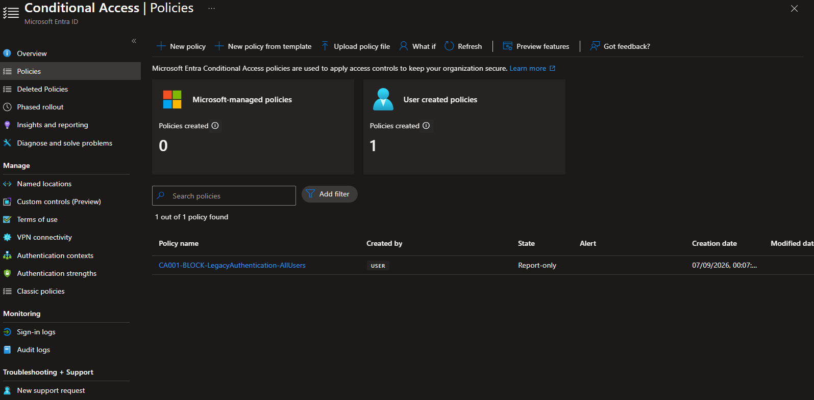
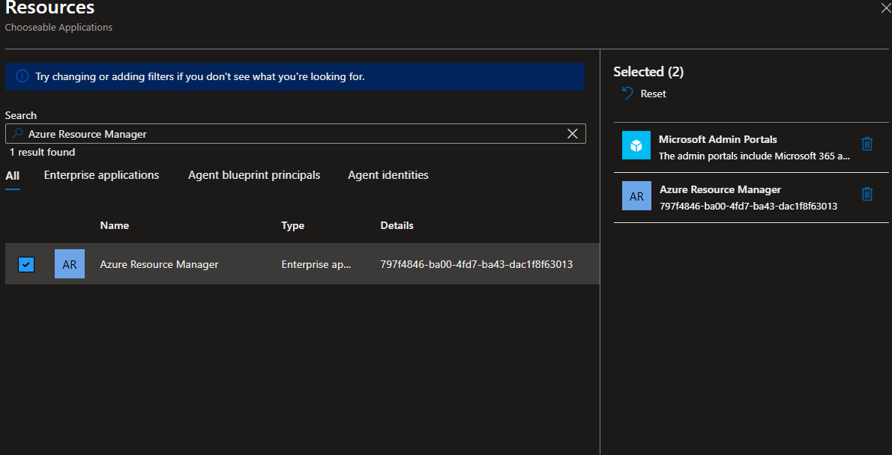
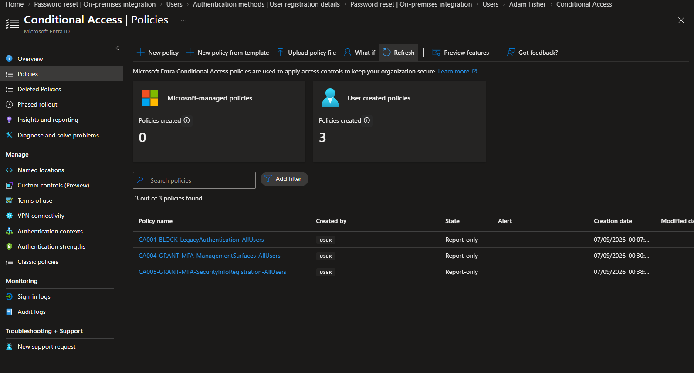
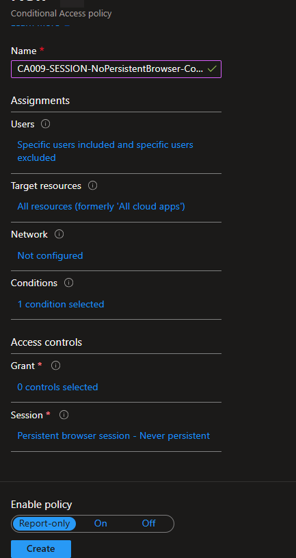
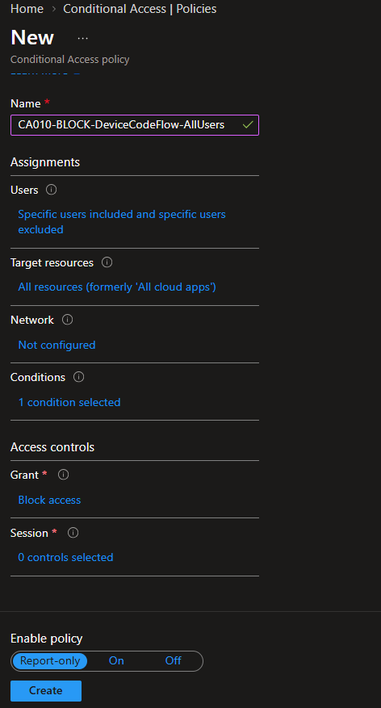
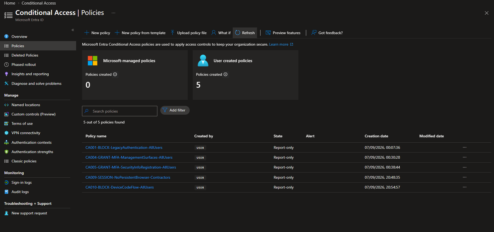

# Conditional Access Report-Only Deployment

## 1. Purpose

This document records Milestone 4 deployment of the first approved Conditional Access wave. It proves that five policies were created in the intended order, limited to controlled populations, and left in Report-only mode.

Milestone 4 validates configuration, not access outcomes. The What If evaluations and controlled sign-in scenarios defined in the test and rollback plan begin in Milestone 5.

## 2. Milestone status

**Status: Complete - five Wave 1 policies are deployed in Report-only mode and their tenant configurations match the approved policy matrix.**

| Deployment control | Observed state | Decision |
| --- | --- | --- |
| Policy population | 5 user-created policies | Matches Wave 1: CA001, CA004, CA005, CA009, and CA010 |
| Enforcement state | All 5 are `enabledForReportingButNotEnforced` | No policy is enforced during this milestone |
| Workforce scope | `GG_CA_Pilot_Workforce` | Retain narrow scope until report-only scenarios are accepted |
| Contractor scope | `GG_IAM_All_Contractors` | Used only by the contractor session policy |
| Recovery exclusion | `GG_CA_Exclude_EmergencyAccess` | Present on every deployed policy |
| Security defaults | Disabled at the Conditional Access transition | Record the lab transition explicitly; no production-equivalence claim is made while policies remain Report-only |
| Deferred controls | CA002, CA003, CA006, CA007, and CA008 not created | Respect the approved deployment-wave gates and CA008 device dependency |

## 3. Security-defaults transition

Microsoft Entra required security defaults to be disabled before the custom Conditional Access policies could be created. The change was made only after P2 licensing, the workforce pilot, two emergency identities, the recovery exclusion, authentication readiness, and password writeback had passed Milestone 3 validation.

The tenant is a controlled synthetic lab. Because all five policies remain Report-only, this milestone records an evaluation state rather than enforced replacement coverage. Milestone 5 must analyze expected and unexpected impact before any policy moves to On.

## 4. CA001 - block legacy authentication

`CA001-BLOCK-LegacyAuthentication-AllUsers` was created first to identify legacy authentication attempts without interrupting access.

| Setting | Deployed value |
| --- | --- |
| Include | `GG_CA_Pilot_Workforce` |
| Exclude | `GG_CA_Exclude_EmergencyAccess` |
| Target resources | All resources |
| Client apps | Exchange ActiveSync clients and Other clients |
| Grant | Block access |
| State | Report-only |

The policy list recorded CA001 in Report-only immediately after creation.

## 5. CA004 - require MFA for management surfaces

`CA004-GRANT-MFA-ManagementSurfaces-AllUsers` provides transitional MFA coverage for administrative portals and Azure management while the universal MFA policy remains behind its later deployment gate.

The Windows Azure Service Management API resource did not initially appear in the Conditional Access picker because its Microsoft service principal was absent from the tenant. The supported Microsoft Graph method created the tenant-local representation of that first-party resource. The picker then displayed it as **Azure Resource Manager**.

| Setting | Deployed value |
| --- | --- |
| Include | `GG_CA_Pilot_Workforce` |
| Exclude | `GG_CA_Exclude_EmergencyAccess` |
| Target resources | Microsoft Admin Portals and Azure Resource Manager |
| Grant | Built-in Multifactor authentication strength |
| State | Report-only |

The resource picker confirmed both required management targets before policy creation.

## 6. CA005 - protect security-information registration

`CA005-GRANT-MFA-SecurityInfoRegistration-AllUsers` protects the action used to register authentication and recovery methods.

| Setting | Deployed value |
| --- | --- |
| Include | `GG_CA_Pilot_Workforce` |
| Exclude | `GG_CA_Exclude_EmergencyAccess` and all supported guest or external user types |
| Target | User action: Register security information |
| Grant | Built-in Multifactor authentication strength |
| State | Report-only |

The staged inventory confirmed CA001, CA004, and CA005 in Report-only after the first three deployments.

## 7. CA009 - prevent persistent contractor browser sessions

`CA009-SESSION-NoPersistentBrowser-Contractors` applies a session control without adding a grant requirement.

| Setting | Deployed value |
| --- | --- |
| Include | `GG_IAM_All_Contractors` |
| Exclude | `GG_CA_Exclude_EmergencyAccess` |
| Target resources | All resources |
| Client apps | Browser |
| Grant | None |
| Session | Persistent browser session: Never persistent |
| State | Report-only |

The pre-creation summary confirmed the browser condition, no grant control, the Never persistent session control, and Report-only state.

## 8. CA010 - block device code flow

`CA010-BLOCK-DeviceCodeFlow-AllUsers` identifies device code authentication within the pilot population. No resource exception was added because no verified Device Registration Service dependency justified one.

| Setting | Deployed value |
| --- | --- |
| Include | `GG_CA_Pilot_Workforce` |
| Exclude | `GG_CA_Exclude_EmergencyAccess` |
| Target resources | All resources |
| Authentication flow | Device code flow |
| Grant | Block access |
| State | Report-only |

The pre-creation summary confirmed one authentication-flow condition, Block access, no session controls, and Report-only state.

## 9. Final inventory and read-only validation

The completed policy inventory contains exactly the five Wave 1 policies. Every row is Report-only.

A Microsoft Graph read-only inspection then compared the hidden tenant settings with the approved matrix. It confirmed the expected groups, exclusions, resources, conditions, grant or session controls, and state for all five policies. The sanitized result is stored in [`data/m04-wave1-report-only-validation.txt`](../data/m04-wave1-report-only-validation.txt).

| Validation check | Result |
| --- | --- |
| Expected policies | 5 |
| Observed policies | 5 |
| Missing policies | 0 |
| Policies in an incorrect state | 0 |
| Configuration mismatches | 0 |
| Enforced policies | 0 |
| Report-only inventory validation | Passed |

## 10. Milestone boundary and next decision

Milestone 4 is complete. It proves deployment accuracy only; it does not claim that a Report-only policy blocked, challenged, or modified a session.

Milestone 5 is next. It will use What If, controlled sign-ins, audit records, and Conditional Access results to compare applicable, nonapplicable, emergency-exclusion, and failure-path behavior with the approved test matrix. Wave 2 policy creation remains gated until the Wave 1 report-only results are accepted.

## 11. Authoritative references

- [Plan a Conditional Access deployment](https://learn.microsoft.com/en-us/entra/identity/conditional-access/plan-conditional-access)
- [Use report-only mode](https://learn.microsoft.com/en-us/entra/identity/conditional-access/concept-conditional-access-report-only)
- [Block legacy authentication](https://learn.microsoft.com/en-us/entra/identity/conditional-access/policy-block-legacy-authentication)
- [Require MFA for Azure management](https://learn.microsoft.com/en-us/entra/identity/conditional-access/policy-old-require-mfa-azure-mgmt)
- [Protect security-information registration](https://learn.microsoft.com/en-us/entra/identity/conditional-access/policy-all-users-security-info-registration)
- [Configure persistent browser session](https://learn.microsoft.com/en-us/entra/identity/conditional-access/howto-conditional-access-session-lifetime)
- [Control authentication flows](https://learn.microsoft.com/en-us/entra/identity/conditional-access/concept-authentication-flows)
- [Conditional Access target resources](https://learn.microsoft.com/en-us/entra/identity/conditional-access/concept-conditional-access-cloud-apps)
