# Conditional Access Scenario Testing and Report-Only Analysis

## 1. Purpose

This document records Milestone 5 validation of the five Wave 1 Conditional Access policies deployed in Milestone 4. It combines What If simulations, controlled sign-ins, report-only policy results, emergency-access checks, and a legacy-authentication activity review.

The milestone proves that Microsoft Entra evaluated the intended identities, resources, client types, authentication flows, grant controls, and session controls. It does not claim that Report-only policies enforced a block, MFA challenge, or browser-session change.

## 2. Milestone status

**Status: Complete - the approved Wave 1 Report-only scenarios produced the expected applicable, nonapplicable, exclusion, success, and failure-path results.**

| Validation area | Recorded outcome |
| --- | --- |
| CA001 legacy authentication | What If predicted Block; modern browser authentication was not targeted; no matching non-interactive legacy sign-ins were found in the one-month review window |
| CA004 management MFA | What If required the built-in Multifactor authentication strength; a controlled Azure Portal sign-in recorded `reportOnlySuccess` |
| CA005 registration protection | What If required MFA for Register security information; a controlled Security info sign-in recorded `reportOnlySuccess` without changing a method |
| CA009 contractor session | What If and two controlled browser sign-ins recorded the Never persistent session control as applicable and successful in Report-only |
| CA010 device code flow | What If predicted Block; a controlled device-code sign-in recorded `reportOnlyFailure`, meaning enforcement would have blocked it |
| Emergency recovery | Both emergency identities were evaluated and no Wave 1 policy applied |
| Enforcement changes | None; all five policies remained Report-only |

## 3. Test safety and evidence handling

- A synthetic pilot contractor identity was used for the controlled workforce scenarios.
- Both cloud-only emergency identities were tested through What If without publishing their names.
- No legacy protocol, weak credential, authentication-method deletion, or unprepared-user condition was created merely to produce evidence.
- Screenshots exclude user principal names, object identifiers, tenant identifiers, IP addresses, request identifiers, session identifiers, token identifiers, and credentials.
- Policy states were not changed during this milestone.

## 4. CA001 - legacy authentication

### 4.1 TS-01 applicable legacy-client simulation

What If evaluated a pilot identity accessing Exchange Online from Windows through an Exchange ActiveSync legacy-client classification. `CA001-BLOCK-LegacyAuthentication-AllUsers` was the applicable policy and its predicted grant decision was Block access.

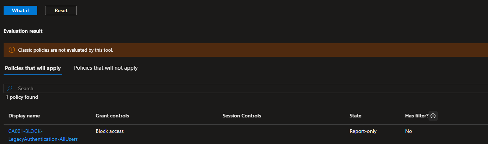

This proves the assignment and client-app condition evaluate as designed. Because the policy was Report-only, the simulation does not claim that a real client was blocked.

### 4.2 TS-02 modern-browser nonapplicability

The same resource was evaluated with Browser as the client app. CA001 moved to Policies that will not apply with Client app as the reason. CA010 also remained nonapplicable because a normal browser sign-in did not use device code flow.

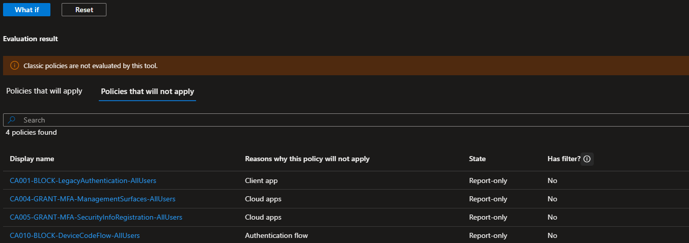

### 4.3 One-month legacy-activity review

The non-interactive sign-in log was reviewed tenant-wide for Exchange ActiveSync and Other clients across the available one-month window. No matching events were returned.

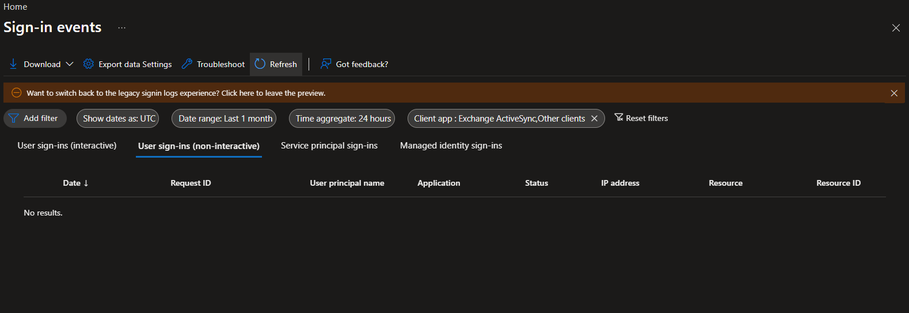

The absence of events is a monitoring result, not proof of enforcement. A real legacy flow was not manufactured because the safe-execution gate was not met and weakening authentication solely for evidence would be unjustified.

## 5. CA004 and CA009 - management access and contractor sessions

This section validates `CA004-GRANT-MFA-ManagementSurfaces-AllUsers` and `CA009-SESSION-NoPersistentBrowser-Contractors`.

### 5.1 TS-09 management-resource simulation

What If evaluated Azure Resource Manager with Browser as the client app. CA004 required the built-in Multifactor authentication strength. CA009 also applied because the synthetic test identity belonged to the contractor population, demonstrating legitimate overlap between a management grant control and a contractor session control.

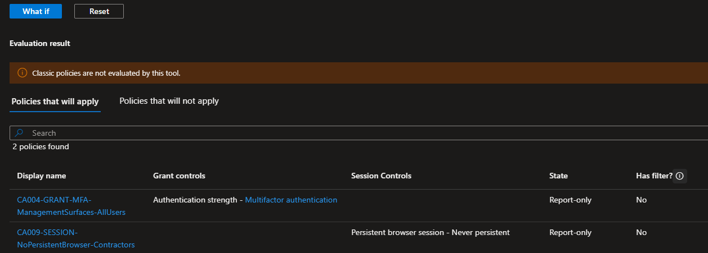

### 5.2 Controlled Azure Portal sign-in

A fresh InPrivate Azure Portal sign-in generated a real Microsoft Entra event for Azure Resource Manager. The Report only view recorded CA004 as Success and CA009 as Success, with `PersistentBrowserSessionMode` shown for CA009.

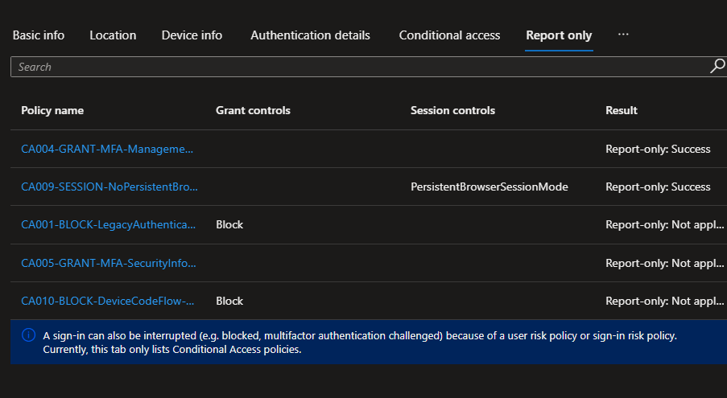

The CA004 result shows that the sign-in satisfied the evaluated MFA requirement. The CA009 result confirms that the Never persistent session control matched the event; it does not prove that browser persistence changed because Report-only does not enforce session controls.

## 6. CA005 - security-information registration

This section validates `CA005-GRANT-MFA-SecurityInfoRegistration-AllUsers`.

### 6.1 Registration user-action simulation

What If evaluated the Register security information user action for the pilot identity. CA005 required the built-in Multifactor authentication strength. CA009 also evaluated because the scenario used a browser and the identity belonged to the contractor population.

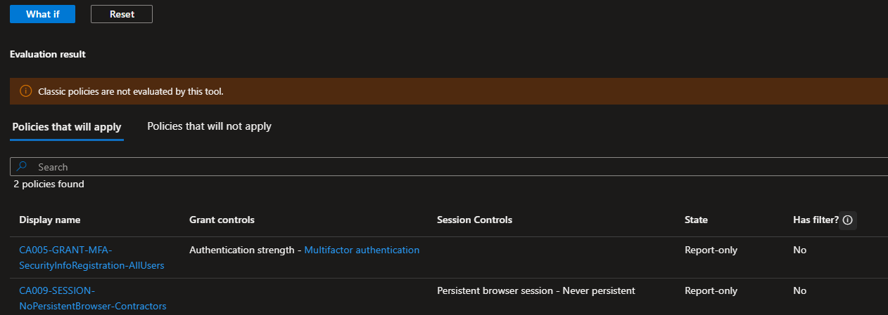

### 6.2 Controlled Security info sign-in

The prepared test identity opened Microsoft My Account and navigated to Security info using an InPrivate session. No authentication method was added, changed, or deleted. The resulting sign-in recorded CA005 as Report-only: Success and CA009 as Report-only: Success.

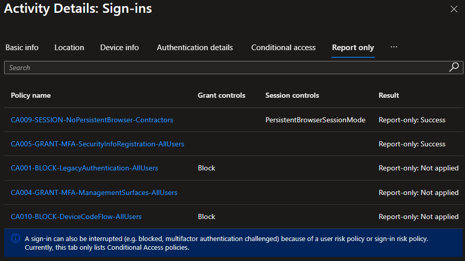

This completes the Report-only evaluation for the prepared-user path. The unprepared-user failure path remains deferred until a dedicated disposable identity and an approved bootstrap or recovery procedure are available.

## 7. CA010 - device code flow

This section validates `CA010-BLOCK-DeviceCodeFlow-AllUsers`.

### 7.1 TS-23 applicable device-code simulation

What If evaluated a modern desktop client using Device code flow. CA010 was the only applicable policy and predicted Block access.

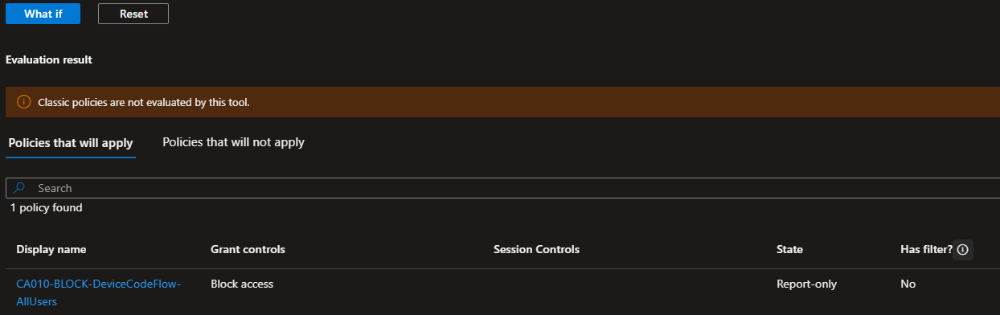

### 7.2 TS-20 emergency identity 1

The first emergency identity was evaluated against the device-code scenario. All five Wave 1 policies were nonapplicable. CA001, CA009, and CA010 reported Users and groups as the reason; CA004 and CA005 did not match the selected target resource.

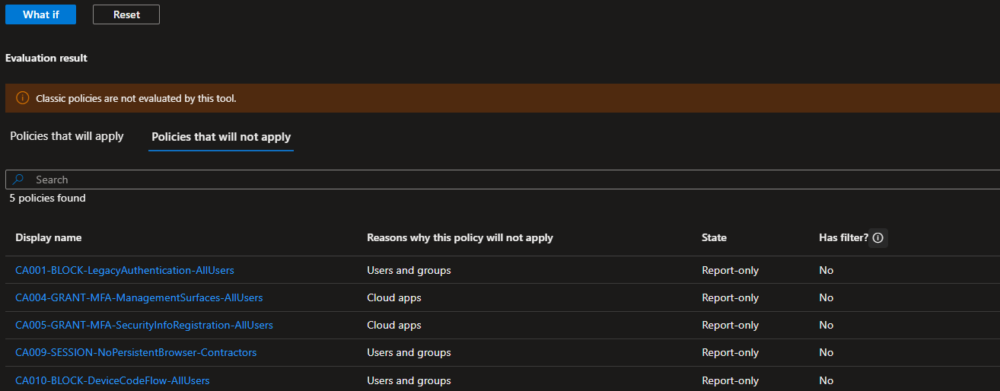

### 7.3 TS-20 emergency identity 2

The same evaluation was repeated for the second emergency identity with the same nonapplicable outcome.

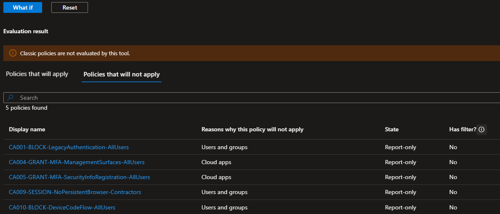

Together with the read-only configuration record showing `GG_CA_Exclude_EmergencyAccess` on every deployed policy, these evaluations preserve the documented recovery boundary without publishing either emergency identity.

### 7.4 Controlled device-code sign-in

A controlled Microsoft Graph Command Line Tools authentication used device code flow. The sign-in succeeded because CA010 remained Report-only. In the Report only view, CA010 showed Block and Report-only: Failure.

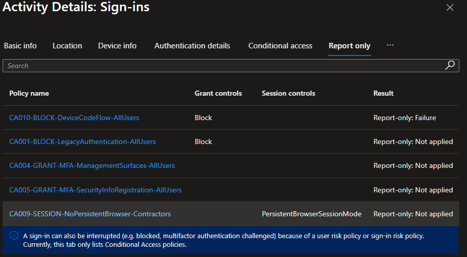

For a block policy, `reportOnlyFailure` means the policy matched and would have blocked the request if enabled. The portal independently displayed Original transfer method as Device code flow; the screenshot containing sign-in identifiers was excluded from public evidence. The sanitized observation is retained in [`data/m05-report-only-validation.txt`](../data/m05-report-only-validation.txt).

## 8. Scenario disposition

| Scenario | Milestone 5 disposition | Outcome |
| --- | --- | --- |
| TS-01 | What If applicable case completed; real legacy traffic not generated | Passed with documented safe-test limitation |
| TS-02 | Modern browser What If case completed | Passed |
| TS-09 | Management What If and controlled Azure Portal sign-in completed | Passed |
| TS-10 | Prepared-user registration What If and controlled Security info sign-in completed; no method changed | Report-only evaluation passed |
| TS-11 | No dedicated unprepared disposable identity used | Deferred |
| TS-18 | Applicability and Report-only session-control result recorded | Enforcement behavior deferred to Milestone 6 |
| TS-20 | Both emergency identities evaluated | Passed |
| TS-23 | Device-code What If and controlled sign-in completed | Passed |
| TS-24 | Normal browser evaluation showed CA010 nonapplicable | Passed |

## 9. Exit decision and Milestone 6 boundary

Milestone 5 is complete for the approved Report-only scope. The observed results match the Wave 1 design, both emergency identities remain outside the restrictive boundary, and no unexpected policy application was found.

Milestone 6 is next and will perform controlled pilot enforcement one policy at a time. Before each state change, the operator must reconfirm emergency access, capture the pre-change state, preserve an independent administrator session, execute the mapped positive and negative tests, inspect sign-in evidence, and return the policy to Report-only if any rollback trigger occurs.

The following claims remain prohibited until Milestone 6 evidence exists:

- CA001 blocked a real legacy-authentication attempt.
- CA005 denied an unprepared user.
- CA009 prevented browser-session persistence.
- CA010 blocked a real device-code sign-in.
- Any Wave 1 control protects users outside its current controlled scope.

## 10. Authoritative references

- [Conditional Access What If](https://learn.microsoft.com/en-us/entra/identity/conditional-access/what-if-tool)
- [Use report-only mode](https://learn.microsoft.com/en-us/entra/identity/conditional-access/concept-conditional-access-report-only)
- [Conditional Access insights and reporting](https://learn.microsoft.com/en-us/entra/identity/conditional-access/howto-conditional-access-insights-reporting)
- [Microsoft Entra sign-in logs](https://learn.microsoft.com/en-us/entra/identity/monitoring-health/concept-sign-ins)
- [Block legacy authentication](https://learn.microsoft.com/en-us/entra/identity/conditional-access/policy-block-legacy-authentication)
- [Require MFA for Azure management](https://learn.microsoft.com/en-us/entra/identity/conditional-access/policy-old-require-mfa-azure-mgmt)
- [Protect security-information registration](https://learn.microsoft.com/en-us/entra/identity/conditional-access/policy-all-users-security-info-registration)
- [Configure persistent browser session](https://learn.microsoft.com/en-us/entra/identity/conditional-access/howto-conditional-access-session-lifetime)
- [Control authentication flows](https://learn.microsoft.com/en-us/entra/identity/conditional-access/concept-authentication-flows)
- [Manage emergency access accounts](https://learn.microsoft.com/en-us/entra/identity/role-based-access-control/security-emergency-access)
